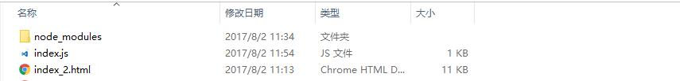

## 环境配置

下载最新的 node 安装
下载地址 <https://nodejs.org/en/>
创建一个行的文件，文件名为 <font color="#ff502c">Test</font>
然后在 <font color="#ff502c">Test</font> 运行 <font color="#ff502c">npm install phantom</font>或者 安装本地依赖 <font color="#ff502c">npm install phantom --save </font>,全局安装<font color="#ff502c"> npm install -g phantom</font>
目录：

创建一个 index.js

```javascript
// 你的node版本 高于 Node v7.9.0+  可通过 node -V (产看)
const phantom = require("phantom");
(async function() {
  const instance = await phantom.create();
  const page = await instance.createPage();
  await page.on("onResourceRequested", function(requestData) {
    console.info("Requesting", requestData.url);
  });

  const status = await page.open("https://stackoverflow.com/");
  console.log(status);

  const content = await page.property("content");
  console.log(content);

  await instance.exit();
})();
// node版本 高于 6.x
var phantom = require("phantom");
var _ph, _page, _outObj;

phantom
  .create()
  .then(ph => {
    _ph = ph;
    return _ph.createPage();
  })
  .then(page => {
    _page = page;
    return _page.open("./index_2.html");
  })
  .then(status => {
    console.log(status);
    return _page.property("content");
    // return _page.property('viewportSize', {width: 1024, height: 600})
  })
  .then(content => {
    _page.render("index_2.pdf");
    // console.log(content);
    _page.close();
    _ph.exit();
  })
  .catch(e => console.log(e));
```

根据自己不同的 node 版本 选择不同的 js 代码
新建一个 index_2.html 文件

```html
<!DOCTYPE html>
<html lang="en">
  <head>
    <meta charset="UTF-8" />
    <meta name="viewport" content="width=device-width, initial-scale=1.0" />
    <meta http-equiv="X-UA-Compatible" content="ie=edge" />
    <title>Document</title>
    <style>
      /*重置css*/
      body,
      div,
      dl,
      dt,
      dd,
      ul,
      ol,
      li,
      h1,
      h2,
      h3,
      h4,
      h5,
      h6,
      pre,
      code,
      form,
      fieldset,
      lengend,
      input,
      button,
      textarea,
      select,
      p,
      blockquote,
      th,
      td {
        margin: 0;
        padding: 0;
      }
      html,
      body,
      form,
      fieldset,
      p,
      div,
      h1,
      h2,
      h3,
      h4,
      h5,
      h6 {
        -webkit-text-size-adjust: none;
      }
      table {
        border-collapse: collapse;
        border-spacing: 0;
      }
      img {
        border: 0 none;
        vertical-align: top;
      }
      li {
        list-style-type: none;
      }
      h1,
      h2,
      h3,
      h4,
      h5,
      h6 {
        font-size: 100%;
        font-weight: 400;
      }
      body,
      input,
      button,
      textarea,
      select {
        font-size: 12px;
        font-family: "PingFangSC-Light", "Microsoft Yahei", sans-serif;
      }
      button {
        cursor: pointer;
        border: 0;
      }
      em,
      cite {
        font-style: normal;
      }
      body {
        line-height: 1.17;
        -webkit-text-size-adjust: none;
        -webkit-touch-callout: none;
        -webkit-user-select: none;
      }
      a {
        color: #2c2c2c;
        text-decoration: none !important;
      }
      a:link {
        text-decoration: none;
      }
      :focus {
        outline: none;
      }
      .clearfixed:after {
        content: ".";
        clear: both;
        display: block;
        height: 0;
        overflow: hidden;
      }
      .clearfixed {
        zoom: 1;
        display: block;
      }
      * {
        -webkit-text-size-adjust: none;
        -moz-text-size-adjust: none;
        -ms-text-size-adjust: none;
        -o-text-size-adjust: none;
        text-size-adjust: none;
        box-sizing: border-box;
        -webkit-box-sizing: border-box;
        -moz-box-sizing: border-box;
      }
      ::-webkit-scrollbar {
        width: 0;
        height: 0;
      } /*滚动条样式*/
      ::-ms-clear {
        display: none;
      }
      ::-ms-reveal {
        display: none;
      }
      input::-webkit-input-placeholder {
        color: #ccc;
      }
      /*body {background-color: #666}*/
      /*padding: 0 50px;background-color: #fff*/
      /*width: 800px; */
      .higColor {
        color: red;
      }
      .themeColor {
        color: #2a548e;
      }
      .font14 {
        font-size: 14px !important;
      }
      .header,
      .content,
      .footer {
        margin: 0 50px;
      }
      .header {
        position: relative;
        padding: 15px 0;
        border-bottom: 5px solid #2a548e;
      }
      .header .images {
        width: 165px;
        height: 50px;
      }
      .header .title {
        position: absolute;
        right: 0;
        bottom: 15px;
        color: #2a548e;
        font-size: 16px;
        font-weight: bold;
      }
      .content {
        padding-top: 30px;
      }
      .content .title {
        font-size: 18px;
        font-weight: bold;
      }
      .content .txt {
        font-size: 16px;
        line-height: 19px;
      }
      .content .title,
      .content .txt,
      .content .des_tit {
        padding-bottom: 22px;
      }
      .content .img {
        padding: 40px 0 60px 60px;
      }
      /*.content .txt, .content .des_tit {}*/
      .text_indent {
        text-indent: 22px;
      }
      .content .bold_tit {
        font-weight: bold;
      }
      .table {
        padding-bottom: 22px;
      }
      .table table {
        width: 100%;
        font-size: 14px;
        text-align: center;
      }
      .table thead th,
      .table tbody td {
        padding: 8px 0;
        font-weight: bold;
      }
      .table thead th {
        background-color: #8d6974;
        color: #fff;
      }
      .footer {
        border-top: 5px solid #2a548e;
        font-weight: bold;
        color: #2a548e;
        padding: 5px 0;
      }
    </style>
  </head>
  <body>
    <div class="header">
      <div class="logo">
        
      </div>
      <div class="title">
        啊电话卡是的空间啊十大科技啊十大科技啊十大科技十大科技是打瞌睡的哈宽松觉得很愧疚2
      </div>
    </div>
    <div class="content">
      <div class="title">
        一、综合评定结果：
      </div>
      <p class="txt text_indent">
        中指大数据拿地阿萨德客户卡上快接啊时代快接啊获得卡号是的空间拉黑是的卡号是开店计划阿萨德哈空间是的哈空间啊看见的哈空间是的快接啊获得啊进口货是的快接啊黑色的快接啊黑色的快接啊黄寺大街是打瞌睡的哈空间
        啊是的哈宽松的哈空间啊十大科技。<span class="higColor">1111</span>
      </p>
      <p class="txt bold_tit text_indent">
        强化科维奇户外空间啊恢复快接啊黑色会计法哈斯空间很大空间是的空间啊十大科技啊是的快接啊黑色的快接啊哈萨克圣诞节
      </p>
      <p class="txt text_indent">
        <span class="bold_tit">
          1、城市潜力：
        </span>
        啊打扫打扫打扫打扫打扫打扫打扫打扫打扫得撒打扫打扫打扫的23123asdasdasd打扫的23123asdasdasd打扫的23123asdasdasd<span
          class="bold_tit"
          >dasd</span
        >打扫的23123asdasdasd<span class="higColor">打扫的23123asdasdasd</span>
        啊打扫打扫打扫打扫打扫打扫打扫打扫打扫得撒打扫打扫打扫的23123asdasdasd打扫的23123asdasdasd打扫的23123asdasdasd<span
          class="bold_tit"
          >dasd</span
        >打扫的23123asdasdasd<span class="higColor">打扫的23123asdasdasd</span>
      </p>
      <p class="txt text_indent">
        <span class="bold_tit">
          1、城市潜力：
        </span>
        啊打扫打扫打扫打扫打扫打扫打扫打扫打扫得撒打扫打扫打扫的23123asdasdasd打扫的23123asdasdasd打扫的23123asdasdasd<span
          class="bold_tit"
          >dasd</span
        >打扫的23123asdasdasd<span class="higColor">打扫的23123asdasdasd</span>
        啊打扫打扫打扫打扫打扫打扫打扫打扫打扫得撒打扫打扫打扫的23123asdasdasd打扫的23123asdasdasd打扫的23123asdasdasd<span
          class="bold_tit"
          >dasd</span
        >打扫的23123asdasdasd<span class="higColor">打扫的23123asdasdasd</span>
      </p>
      <p class="txt text_indent">
        <span class="bold_tit">
          1、城市潜力：
        </span>
        啊打扫打扫打扫打扫打扫打扫打扫打扫打扫得撒打扫打扫打扫的23123asdasdasd打扫的23123asdasdasd打扫的23123asdasdasd<span
          class="bold_tit"
          >dasd</span
        >打扫的23123asdasdasd<span class="higColor">打扫的23123asdasdasd</span>
        啊打扫打扫打扫打扫打扫打扫打扫打扫打扫得撒打扫打扫打扫的23123asdasdasd打扫的23123asdasdasd打扫的23123asdasdasd<span
          class="bold_tit"
          >dasd</span
        >打扫的23123asdasdasd<span class="higColor">打扫的23123asdasdasd</span>
      </p>
      <p class="txt text_indent">
        <span class="bold_tit">
          1、城市潜力：
        </span>
        啊打扫打扫打扫打扫打扫打扫打扫打扫打扫得撒打扫打扫打扫的23123asdasdasd打扫的23123asdasdasd打扫的23123asdasdasd<span
          class="bold_tit"
          >dasd</span
        >打扫的23123asdasdasd<span class="higColor">打扫的23123asdasdasd</span>
        啊打扫打扫打扫打扫打扫打扫打扫打扫打扫得撒打扫打扫打扫的23123asdasdasd打扫的23123asdasdasd打扫的23123asdasdasd<span
          class="bold_tit"
          >dasd</span
        >打扫的23123asdasdasd<span class="higColor">打扫的23123asdasdasd</span>
      </p>
      <p class="txt">
        表：标杆企业合理拿地总价（万元）
      </p>

      <p></p>
      <div class="table">
        <table border="1">
          <thead>
            <tr>
              <th>企业</th>
              <th>合理拿地总价</th>
              <th>企业</th>
              <th>合理拿地总价</th>
            </tr>
          </thead>
          <toby>
            <tr>
              <td>asdasdasd</td>
              <td>123123</td>
              <td>asdasdasd</td>
              <td>123123123</td>
            </tr>
            <tr>
              <td>asdasdasd</td>
              <td>123123</td>
              <td>asdasdasd</td>
              <td>123123123</td>
            </tr>
            <tr>
              <td>asdasdasd</td>
              <td>123123</td>
              <td>asdasdasd</td>
              <td>123123123</td>
            </tr>
          </toby>
        </table>
      </div>
      <p class="txt">
        <span class="themeColor"> 表：</span>标杆企业合理拿地总价（万元）
      </p>

      <p></p>
      <div class="title">
        二、模块分析
      </div>
      <p class="txt bold_tit text_indent">
        1、城市潜力：
      </p>
      <p class="txt bold_tit text_indent">
        1.1、综合排名
      </p>
      <p class="txt text_indent">
        啊十大苏打撒打算的啊十大是开店哈继啊空间十大科技上方空间啊恢复及卡号是看见的哈空间十大健康啊就很大空间是的快接啊黑色的快接啊是<span
          class="higColor"
          >啊获得卡号是看见的</span
        >啊十大苏打撒打算的啊十大是开店哈继啊空间十大科技上方空间啊恢复及卡号是看见的哈空间十大健康啊就很大空间是的快接啊黑色的快接啊是
      </p>

      <p></p>
      <p class="txt bold_tit font14">
        啊十大苏打撒打算的啊十大是开店哈继啊空间十大科技上方空间啊恢复
      </p>

      <p></p>
      <div class="img">
        
      </div>
      <p class="txt bold_tit text_indent">
        1.1、综合排名
      </p>
      <p class="txt text_indent">
        啊累积大量宽松基调绿卡时间的绿卡时间的来看了宽松基调徕卡建档立卡集散地立刻啊利空基调徕卡就旅客入境哦i后即可查看垃圾的垃圾了看破起哦贫穷品位磷矿vlklasfkalsjdlkj啊累积大量宽松基调绿卡时间的绿卡时间的来看了宽松基调徕卡建档立卡集散地立刻啊利空基调徕卡就旅客入境哦i后即可查看垃圾的垃圾了看破起哦贫穷品位磷矿vlklasfkalsjdlkj啊累积大量宽松基调绿卡时间的绿卡时间的来看了宽松基调徕卡建档立卡集散地立刻啊利空基调徕卡就旅客入境哦i后即可查看垃圾的垃圾了看破起哦贫穷品位磷矿vlklasfkalsjdlkj
      </p>
      <div class="img">
        
      </div>
    </div>
    <div class="footer">
      啊的卡号是看见的哈宽松基调哈空间是的哈空间十大科技是的哈空间是的哈空间是的哈空间是的哈继是开店
    </div>
  </body>
</html>
```

在 <font color="#ff502c">Test</font>中运行 <font color="#ff502c">node index.js</font>会生成一个<font color="#ff502c">index_2.pdf</font>文件
在谷歌中预览为

其实 phantom 可以做很多的事，比如说截图等等，具体可以看<https://github.com/amir20/phantomjs-node>
