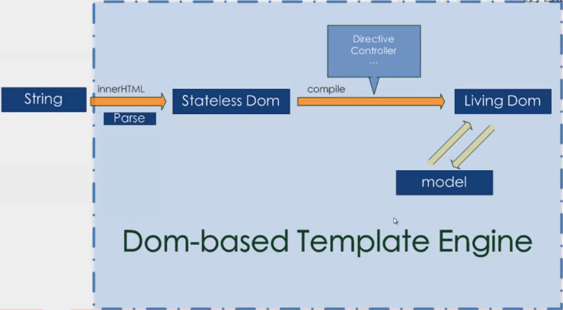
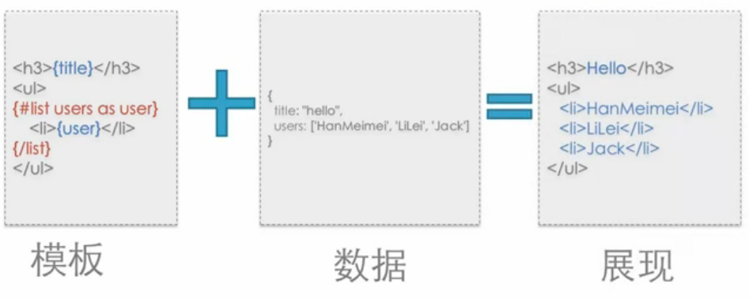
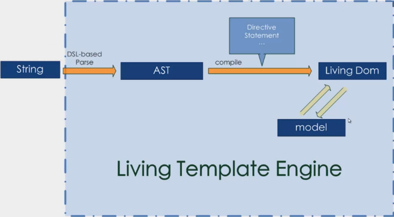
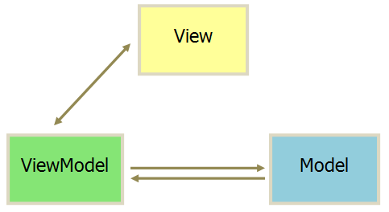

## 框架和库

库(lib)具有一下三个特点：
1、是针对特定问题的解答，具有专业性
2、你控制应用的流程
3、被动的被调用
框架(framework)具有以下三个特点：
1、具有控制反转(inverse of control)的功能
2、决定应用程序的声明周期
3、一般来说,集成了大量的库
如下图所示，框架会在特定的时间要求程序执行某段代码。框架决定了什么时候调用库，决定了什么时候要求代码去执行特定功能

而实际上，一个库有事也可以称之为框架，而库里面继承的方法称之为库
框架和库的区别不是由实际大小决定，而是有思考角度来决定。框架和库世界上可以统称为解决方案

## 解决方案

前端开发中的解决方案主要用于解决以下 7 各方面的问题：
1、DOM
2、Communication(通信)
3、Utililty(工具库)
4、Templating(模版集成)
5、Component(组件)
6、Routing(router 路由)
7、architecture(架构)
为什么使用外部的解决方案
1、提高开发效率
2、可靠性高(浏览器兼容性，测试覆盖)
3、配备优良，如文档、demo 及工具等
4、代码设计合理、更优雅
5、专业性高
如果问题过于简单，或者备选框架的质量和可靠性无法保证，再或者无法满足业务需求，则不应该选择外部的框架。如果团队中已经有相关的累积，就更不需要使用了
一般地，解决方案要实际开发中有以下 3 种使用方式：
1、开放式：基于外部模块系统，并自由组合
2、半开放式：基于一个定制的模块系统，内部外部解决方案共存
3、封闭式：深度定制的模块系统，很少需要引入外部模块

### DOM

接下来，将针对解决方案中提到的 7 个问题进行分别介绍，首先是 DOM
关于 DOM，主要包括 Selector(选择器)、Manipulation(DOM 操作)、Event(事件)、Animation(动画)这四个部分
DOM 相关的解决方案主要用于提供以下操作　
　 1、提供便利的 DOM 查询、操作、移动等操作
　 2、提供事件绑定及事件代理支持
　 3、提供浏览器特性检测及 UserAgent 侦测
　 4、提供节点属性、样式、类名的操作
　 5、保证目标平台的跨浏览器支持

#### 【常用方案】

    常用的DOM解决方案有 jQuery、zepto.JS、MOOTOO.JS等

jQuery 是曾经风靡一时的最流行的前端解决方案，jQuery 特有的链式调用的方式简化了 javascript 的复杂操作，而且使人们不再需要关心兼容性，并提供了大量的实用方法
　　 zepto 是 jQuery 的精简版，针对移动端去除了大量 jQuery 的兼容代码，提供了简单的手势，部分 API 的实现方式不同
　　 mootools 源码清晰易懂，严格遵循 Command-Query(命令-查询)的接口规范，没有诸如 jQuery 的两义性接口。还有一个不得不提的特点是，使用选择器获取的是 DOM 原生对象，而不是被包装过的对象。而它支持的诸多方法则是通过直接扩展 DOM 原生对象实现的，这也是它的争议所在
　　相比较而言，最稳妥的 DOM 解决方案是 jQuery

#### 【专业领域】

上面的解决方案用于解决 DOM 一般的通用问题。随着技术的发展，DOM 的专业领域出现一些小而精致的解决方案
　　 1、手势
　　 Hammer.JS 包括了常见手势封装（Tab、Hold、Transform、Swifp）并支持自定义扩展
　　 2、局部滚动
　　 iscroll.JS 是移动端 position:fix + overflow:scroll 的救星
　　 3、高级动画
　　 Velocity.JS 可以复杂动画序列实现，不仅局限于 DOM
　　 4、视频播放
　　 Video.JS 类似原生 video 标签的使用方式，对低级浏览器使用 flash 播放器

### 通信

关于通信，主要包括 XMLHttpRequest、Form、JSONP、Socket 等
　　通信相关的解决方案主要用于提供以下操作
　　 1、处理与服务器的请求与相应
　　 2、预处理请求数据与响应数据 Error/Success 的判断封装
　　 3、多类型请求，统一接口（XMLHttpRequest1/2、JSONP、iFrame）
　　 4、处理浏览器兼容性

#### 【常用方案】

    除了jQuery等，其他常用的通信解决方案有Reqwest、qwest等

Reqwest 支持 JSONP，稳定性高，IE6+支持，CORS 跨域，Promise/A 支持
　　 qwest 代码少、支持 XMLHttpRequest2、CORS 跨域、支持高级数据类型（ArrayBuffer、Blob、FormData）

#### 【专业领域】

对于实时性要求较高的需求可以使用 socket.io，它实时性高，支持二进制数据流，智能自动回退支持，且支持多种后端语言

### 工具包

工具包(Utililty)的主要职责包括以下：
　　 1、提供 JavaScript 原生不提供的功能
　　 2、包装原生方法，使其便于使用
　　 3、异步队列及流程控制

#### 【常用方案】

常用的工具包解决方案有 es5-shim、es6-shim、underscore、Lodash 等　　
　　上面提到的 shim，也是经常听到的一个词，翻译过来是垫片的意思。对于 es5、es6 等标准包括的一些新方法，由于浏览器兼容性不高，所以无法直接使用它们。这时，就需要在保证实现与规范一致的基础上，来扩展原型方法，这种做法就叫做 shim。好处在于，实际上就是在使用 javascript 的语法，但不用去考虑低版本浏览器的兼容性问题
　　 es5-shim 提供 ES3 环境下的 ES5 支持
　　 es6-shim 提供 ES5 环境下的 ES6 支持
　　 underscore 提供兼容 IE6+ 的扩展功能函数
　　 Lodash 是 underscore 的高性能版本，方法多为 runtime 编译出来的

### 模板

模板主要包括三类：基于字符串的模板(String-based)、基于 DOM 的模板(DOM-based)、活动模板(Living Template)
　　 1、基于字符串的模板(String-based)，解决方案包括(dustjs、hogan.js、dot.js)

原理如下：输入一段模板字符串，通过编译之后 ，生成一段 Function，通过 Function 的 render 或类 render 函数渲染输入的数据 data，输出模板字符串，字符串通过 innerHTML 或类似的方式渲染成最后的 DOM 结构。这类模板的问题在于通过字符串生成 DOM 之后就不再变化，如果在改变输入的数据 data，需要重新 render，重新生成一个全新的 DOM 结构，性能较差。但该模板可以在服务器端运行

2、基于 DOM 的模板(DOM-based)，解决方案包括(angularjs、vuejs、knockout)

原理如下：将输入的字符串模板通过 innerHTML 转换为一个无状态 DOM 树，然后遍历该节点树，去抓取关键属性或语句，来进行相关的绑定，进而变成了有状态的 DOM 树，最终导致 DOM 树会与数据模型 model 进行绑定。这类模板的特点是修改数据时，会使有状态的 DOM 树实时更新，运行时性能更好，也会保留 DOM 中的已有事件

3、活动模板(Living Template)，解决方案包括(RegularJS、RactiveJS、htmlbar)

原理如下：活动模板融合了字符串模板和 DOM 模板的技术，模板字符串 string 通过自定义的解析器 DSL-based Parse 解析成 AST(抽象语法树)，通过遍历 AST，使用 createElement()、setAttribute()等原生 DOM 方法，生成 DOM 树，最终导致 DOM 树会与数据模型 model 进行绑定。由于其内部完全不使用 innerHTML，所以安全性较高

### 组件

组件(Component)的主要职责包括以下：
　　 1、提供基础的 CSS 支持
　　 2、提供常见的组件，如 slider、Modal 等
　　 3、提供声明式的调用方式（类似 Bootstrap）

#### 【常用方案】

常用的组件解决方案有 Bootstrap、Foundation 等，两者具有移动端 first 的流式栅格系统，由 sass 组织，可定制 UI
Bootstrap 封装了常用的组件，是目前最火的组件解决方案
　 Foundation 在国内知名度不高

### 路由

路由在单页系统中非常重要，主要职责如下
　　 1、监听 URL 变化，并通知注册的模块
　　 2、通过 JavaScript 进行主动跳转
　　 3、历史管理
　　 4、对目标浏览器的兼容性支持
　　无论什么框架，在完成配置之后，内部都有如下图所示的类似的路由表。

#### 【常用方案】

    常用的路由解决方案有page.JS、Director.JS、Stateman、crossroad.JS等

page.JS 类似 Express.Router 的路由规则的前端路由库
　　 Director.JS 可以前后端使用同一套规则定义路由
　　 Stateman 处理深层复杂路由的独立路优库
　　 crossroad.JS 老牌路由库，API 功能较为繁琐

### 架构

所有的架构(architecture)都是一个目的，就是解耦。解耦有很多方式，可以通过事件、分层等
市面上，有很多架构模式，包括 MVC、MVVM、MV\*等
　　架构的职责主要包括以下：
　　 1、提供一种范式帮助（强制）开发者进行模块解耦
　　 2、视图与模型分离
　　 3、容易进行单元测试
　　 4、容易实现应用扩展
　　以 MVVM 为例，如下图所示。它包括 Model(数据层或模型层)、View(视图层)、ViewModel(控制层)
　　 Model(数据层或模型层)表示数据实体，它们用于记录应用程序的数据
　　 View(视图层)用于展示界面，界面是数据定制的反映，它包含样式结构定义以及 VM 享有的声明式数据以及数数据绑定
ViewModel(控制层)是 View 与 Model 的粘合，它通过绑定事件与 View 交互并可以调用 Service 处理数据持久化，也可以通过数据绑定将 Model 的变动反映到 View 中

#### 【SPA】

    要特点注意的是，MV* !== SPA(单页系统)

SPA 应用程序的逻辑比较复杂，需要一种模式来进行解耦，但并不一定是 MV\*模式

####

最后推荐一个框架选型网站https://www.javascripting.com，该网站根据不同的需求的选择，给出当下流行的框架选型
