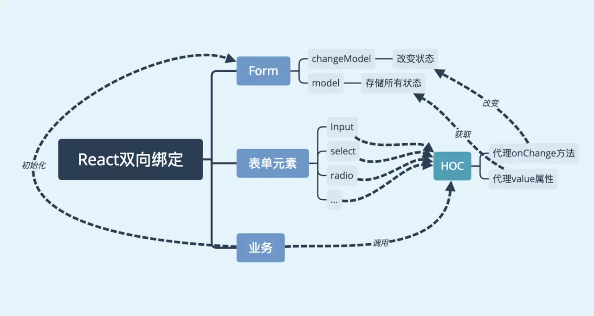

## 简介
> 高阶组件（HOC）是 React 中用于复用组件逻辑的一种高级技巧。HOC 自身不是 React API 的一部分，它是一种基于 React 的组合特性而形成的设计模式。

高阶组件可以看作React对装饰模式的一种实现，**高阶组件就是一个函数，且该函数接受一个组件作为参数，并返回一个新的组件**。

**语法**
```javascript
    const EnhancedComponent = higherOrderComponent(WrappedComponent);
```
可以从下面几个方面探索HOC。


**HOC的实现方式**
- 属性代理
- 反向继承

**高阶组件的使用场景**
- 操作 props(属性)
- 通过 Refs 访问到组件实例
- 组件状态提升
- 操作state
- 渲染劫持
- 用其他元素包裹 WrappedComponent

## HOC的实现方式
<font color="#ff502c"></font>
`React` 中实现 `HOC` 的两种主要方式：`Props Proxy`(属性代理)（PP）和 `Inheritance Inversion`(反向继承)(II) 。 两者都支持不同的方式来操作 **WrappedComponent** 。

这里不会详细介绍生命周期方法来做什么，因为它不是 `HOC` 的特性，而是 `React` 的特性。 但请注意，使用 `Inheritance Inversion(反向继承)`，您可以为 `WrappedComponent` 创建新的生命周期方法。 记得总是这样调用 `super[lifecycleHook]` ，这样就不会破坏 `WrappedComponent` 。

### 属性代理 Props Proxy
Props Proxy(属性代理)(PP) 以下列方式实现：
```javascript
    function ppHOC(WrappedComponent) {
        return class PP extends React.Component {
            render () {
                return <WrappedComponent {...this.props} />;
            }
        }
    }
```
这里的重要部分是HOC得render方法**返回**WrappedComponent类型的React元素。我们还通过HOC接收到得`props`(属性)，这就是名字`Props Proxy`的由来。

对比原生组件增强的项：
- 操作props
- 可操作组件的生命周期
- 通过 Refs 访问到组件实例
- 用其他元素包裹 WrappedComponent
- 提取 state(状态)

### Inheritance Inversion(反向继承)
Inheritance Inversion(反向继承)(II) 通过以下方式实现：
```javascript
    function iiHOC(WrappedComponent) {
        return class Enhancer extends WrappedComponent {
            render () {
                return super.render();
            }
        }
    }
```
返回的HOC类<font color="#ff502c">Enhancer</font> **继承（extends）了**WrappedComponent。它被成为<font color="#ff502c">Inheritance Inversion(反向继承)</font>，因为它不是用WrappedComponent来继承某些<font color="#ff502c">Enhancer</font>类。而是被<font color="#ff502c">Enhancer</font>被动继承。通过这种方式，他们之间的关系似乎是**反向（inverse）**。
<font color="#ff502c">反向继承</font>允许 <font color="#ff502c">HOC</font> 通过 <font color="#ff502c">this</font> 访问 <font color="#ff502c">WrappedComponent</font> 实例，这意味着它可以访问 <font color="#ff502c">state(状态)</font>，<font color="#ff502c">props(属性)</font>，<font color="#ff502c">组件生命周期方法</font>和 <font color="#ff502c">render</font> 方法。
对比原生组件增强的项：
- 可操作所有传入的props
- 可操作组件的生命周期
- 获取refs
- 可操作state
- 可以渲染劫持

## 高阶组件的使用场景
<hr/>

### 操作 props(属性)
> 通过属性代理实现
你可以`读取、添加、编辑、删除`传给 `WrappedComponent` 的 `props(属性)`。在`删除或编辑`重要的 `props(属性)` 时要小心，你应该通过命名空间确保高阶组件的 `props` 不会破坏 `WrappedComponent`。
```javascript
    function ppHOC(WrappedComponent) {
        return class PP extends React.Component {
            render () {
                const newProps = {
                    ...this.props,
                    userName: 'asyncnode'
                };
                return <WrappedComponent {...newProps} />
            }
        }
    }
```
### 通过 Refs 访问到组件实例
`高阶组件`中可获取原组件的`ref`，通过`ref`获取组件`实例`，如下面的代码，当程序初始化完成后调用原组件的log方法。
> 通过属性代理实现
```javascript
    function refHOC (WrappedComponent) {
        return class RefsHoC extends Component {
            componentDidMount () {
                this.wrapperRef.log()
            }
            render() {
                return <WrappedComponent {...this.props} ref={ref => {this.wrapperRef = ref }} />
            }
        }
    }
```
调用高阶组件的时候并不能获取到原组件的真实ref，需要手动进行传递，[详情请看](https://zh-hans.reactjs.org/docs/forwarding-refs.html#forwarding-refs-to-dom-components)

### 组件状态提升
将原组件的状态提取到`HOC`中进行管理，如下面的代码，我们将`Input`的`value`提取到`HOC`中进行管理，使它变成受控组件，同时不影响它使用`onChange`方法进行一些其他操作。基于这种方式，我们可以实现一个简单的`双向绑定`。
> 通过属性代理实现
示例：在以下提取state(状态)示例中，我们非常规的提取name输入字段的值和onChange处理程序。代码如下：
```javascript
    function ppHOC(WrappedComponent) {
        return class PP extends React.component {
            constructor(props) {
                super(props);
                this.state = {
                    value: ''
                };
                this.onChange = this.onChange.bind(this);
            }
            onChange(event) {
                const { onChange } = this.props;
                this.setState({
                    name: event.target.value
                }, () => {
                    if (typeof onChange === 'function') {
                        onChange(event);
                    }
                });
            }
            render () {
                const { value } = this.state;
                const newProps = {
                    value: name,
                    onChange: this.onChange
                }
                return <WrappedComponent {...this.props} {...newProps} />
            }
        }
    }
```
可以像这样使用它：
```javascript
    @ppHOC //装饰器
    class Example extends React.Component {
        render () {
            return <input {...this.props}/>
        }
    }
```
### 操作state
`HOC`可以读取，编辑和删除 `WrappedComponent` 实例的状态，如果需要，还可以添加更多的 `state(状态)`。 请记住，您正在弄乱 `WrappedComponent` 的 `state(状态)`，这会导致您破坏一些东西。 大多数情况下，`HOC` 应限于读取或添加 `state(状态)` ，而添加 `state(状态)` 时应该被命名为不会弄乱 `WrappedComponent` 的 `state(状态)`。
> 通过反向继承实现
示例：通过访问 `WrappedComponent` 的 `props(属性)` 和 `state(状态)` 进行调试
```javascript
    export function IIHOCDEBUGGER(WrappedComponent) {
        return class II extends WrappedComponent {
            render() {
                return (
                    <div>
                    <h2>HOC Debugger Component</h2>
                    <p>Props</p> <pre>{JSON.stringify(this.props, null, 2)}</pre>
                    <p>State</p><pre>{JSON.stringify(this.state, null, 2)}</pre>
                    {super.render()}
                    </div>
                )
            }
        }
    }

```
这个 `HOC` 用其他元素包裹着 `WrappedComponent` ，并且还显示了 `WrappedComponent` 的实例 `props(属性)` 和 `state(状态)` 。
### 渲染劫持(Render Highjacking)
> 通过反向继承实现
它被称为 渲染劫持(Render Highjacking)，因为 HOC 控制了 WrappedComponent 的渲染输出，并且可以用它做各种各样的事情。
在渲染劫持中，您可以：state(状态)，props(属性)
- 读取，添加，编辑，删除渲染输出的任何 React 元素中的 props(属性)
- 读取并修改 render 输出的 React 元素树
- 有条件地渲染元素树
- 把样式包裹进元素树（就像在 Props Proxy(属性代理) 中的那样）
注：render 是指 WrappedComponent.render 方法
通过**渲染劫持**可以做到**组合渲染**和**条件渲染**.
示例1：**条件渲染**。除非 `this.props.loggedIn` 不为 `true` ，否则此 `HOC` 将准确渲染 `WrappedComponent` 将渲染的内容。（假设 HOC 将收到 loggedIn props(属性)）.
```javascript
    // 通过反向继承实现
    function iiHOC(WrappedComponent) {
        return class Enhancer extends WrappedComponent {
            render() {
                if (this.props.loggedIn) {
                    return super.render()
                } else {
                    return null
                }
            }
        }
    }
    // 通过属性代理实现
    function ppHOC(WrappedComponent) {
        return class PP extends React.Component{
            render () {
                if (this.props.loggedIn) {
                    return <WrappedComponent/>;
                } else {
                    return null;
                }
            }
        }
    }
```
示例2：**组合渲染**。 新增一个title。
```javascript
    // 通过反向继承实现
    function iiHOC(WrappedComponent) {
        return class Enhancer extends WrappedComponent {
            render() {
                <React.Fragment>
                    <div className="title">{this.props.title}</div>
                    {super.render()}
                </React.Fragment>
            }
        }
    }
    // 通过属性代理实现
    function ppHOC(WrappedComponent) {
        return class PP extends React.Component{
            render () {
                <React.Fragment>
                    <div className="title">{this.props.title}</div>
                    <WrappedComponent {...this.props}/>
                </React.Fragment>
            }
        }
    }
```
> 注：在 `Props Proxy`(属性代理) 类型的高阶函数中做不到渲染劫持。
虽然可以通过 `WrappedComponent.prototype.render` 访问 `render` 方法，但是您需要模拟 `WrappedComponent` 实例及其 `props`(属性)，并且可能需要自己处理组件生命周期，而不是依赖 `React` 执行它。 在我的实验中不值得这么做，如果你想做渲染劫持(`Render Highjacking`)，你应该使用 `Inheritance Inversion`(反向继承) 而不是 `Props Proxy`(属性代理)。 请记住，React 在内部处理组件实例，而处理实例的唯一方法是通过 this 或 refs 。
### 用其他元素包裹 WrappedComponent
> 通过属性代理实现
可以将 WrappedComponent 与其他组件和元素包装在一起，以用于样式，布局或其他目的。 一些基本用法可以通过常规父组件来完成.
```javascript
    function ppHOC(WrappedComponent) {
        return class PP extends React.Component {
            render() {
                return (
                    <div style={{display: 'block'}}>
                    <WrappedComponent {...this.props}/>
                    </div>
                )
            }
        }
    }
```

## 命名
使用 `HOC` 包裹组件时，会丢失原始 `WrappedComponent` 的名称，这可能会在开发和调试时影响到您。人们通常做的是通过获取 `WrappedComponent` 的名称并预先添加某些内容来自定义 `HOC` 的名称。 以下内容摘自 `React-Redux` 。用 `HOC` 包裹了一个组件会使它失去原本 `WrappedComponent` 的名字，可能会影响开发和调试。通常会用 `WrappedComponent` 的名字加上一些 前缀作为 HOC 的名字。下面的代码来自 React-Redux:
```javascript
    function getDisplayName(WrappedComponent) {
        return WrappedComponent.displayName || WrappedComponent.name || 'Component';
    }
    HOC.displayName = `HOC(${getDisplayName(WrappedComponent)})`
    //or
    class HOC extends ... {
        static displayName = `HOC(${getDisplayName(WrappedComponent)})`
        ...
    }
```
## 如何使用HOC
上面的示例代码都写的是如何声明一个`HOC`，`HOC`实际上是一个函数，所以我们将要增强的组件作为参数调用`HOC`函数，得到增强后的组件。
```javascript
    class myComponent extends Component {
        render() {
            return (<span>原组件</span>)
        }
    }
    export default inheritHOC(myComponent);
```
### compose
假设现在我们有logger，visible，style等多个HOC，现在要同时增强一个Input组件：
```javascript
    logger(visible(style(Input)))
```
这种代码非常的难以阅读，我们可以手动封装一个简单的函数组合工具，将写法改写如下：
```javascript
    const compose = (...fns) => fns.reduce((f, g) => (...args) => g(f(...args)));
    compose(logger,visible,style)(Input);
```
`compose`函数返回一个所有函数组合后的函数，`compose(f, g, h)` 和 `(...args) => f(g(h(...args)))`是一样的。
很多第三方库都提供了类似`compose`的函数，例如`lodash.flowRight`，`Redux`提供的`combineReducers`函数等。
### Decorators
我们还可以借助ES7为我们提供的Decorators来让我们的写法变的更加优雅：
```javascript
    @logger
    @visible
    @style
    class Input extends Component {
        // ...
    }
```
`Decorators`是`ES7`的一个提案，还没有被标准化，但目前`Babel`转码器已经支持，我们需要提前配置`babel-plugin-transform-decorators-legacy`：
```javascript
    "plugins": ["transform-decorators-legacy"]
```

## HOC的实际应用
多个组件拥有类似的逻辑，我们要对重复的逻辑进行复用， 官方文档中[CommentList](https://zh-hans.reactjs.org/docs/higher-order-components.html)的示例也是解决了代码复用问题。
### 日志打点
某些页面需要记录用户行为，性能指标等等，通过高阶组件做这些事情可以省去很多重复代码。
```javascript
    function logHoc(WrappedComponent) {
        return class extends Component {
            componentWillMount() {
                this.start = Date.now();
            }
            componentDidMount() {
                this.end = Date.now();
                console.log(`${WrappedComponent.dispalyName} 渲染时间：${this.end - this.start} ms`);
                console.log(`${user}进入${WrappedComponent.dispalyName}`);
            }
            componentWillUnmount() {
                console.log(`${user}退出${WrappedComponent.dispalyName}`);
            }
            render() {
                return <WrappedComponent {...this.props} />
            }
        }
    }
```
### 可用、权限控制
```javascript
    function auth(WrappedComponent) {
        return class extends Component {
            render() {
                const { visible, auth, display = null, ...props } = this.props;
                if (visible === false || (auth && authList.indexOf(auth) === -1)) {
                    return display
                }
                return <WrappedComponent {...props} />;
            }
        }
    }

```
`authList`是我们在进入程序时向后端请求的所有权限列表，当组件所需要的权限不列表中，或者设置的 visible是false，我们将其显示为传入的组件样式，或者`null`。我们可以将任何需要进行权限校验的组件应用`HOC`：
```javascript
    @auth
    class Input extends Component {  ...  }
    @auth
    class Button extends Component {  ...  }

    <Button auth="user/addUser">添加用户</Button>
    <Input auth="user/search" visible={false} >添加用户</Input>

```
### 双向绑定
在`vue`中，绑定一个变量后可实现双向数据绑定，即表单中的值改变后绑定的变量也会自动改变。而`React`中没有做这样的处理，在默认情况下，表单元素都是非受控组件。给表单元素绑定一个状态后，往往需要手动书写`onChange`方法来将其改写为**受控组件**，在表单元素非常多的情况下这些重复操作是非常痛苦的。
我们可以借助高阶组件来实现一个简单的双向绑定，代码略长，可以结合下面的思维导图进行理解。

...代码未完成（后续补上）

### 表单校验
基于上面的双向绑定的例子，我们再来一个表单验证器，表单验证器可以包含验证函数以及提示信息，当验证不通过时，展示错误信息：
...代码未完成（后续补上）

## 使用HOC的注意事项
<hr/>

### 静态属性拷贝
当我们应用`HOC`去增强另一个组件时，我们实际使用的组件已经不是原组件了，所以我们拿不到原组件的任何静态属性，我们可以在`HOC`的结尾手动拷贝他们：
```javascript
    function proxyHOC(WrappedComponent) {
        class HOCComponent extends Component {
            render() {
            return <WrappedComponent {...this.props} />;
            }
        }
        HOCComponent.staticMethod = WrappedComponent.staticMethod;
        // ... 
        return HOCComponent;
    }
```
如果原组件有非常多的静态属性，这个过程是非常痛苦的，而且你需要去了解需要增强的所有组件的静态属性是什么，我们可以使用`hoist-non-react-statics`来帮助我们解决这个问题，它可以自动帮我们拷贝所有非React的静态方法，使用方式如下：
```javascript
    import hoistNonReactStatic from 'hoist-non-react-statics';
    function proxyHOC(WrappedComponent) {
        class HOCComponent extends Component {
            render() {
                return <WrappedComponent {...this.props} />;
            }
        }
        hoistNonReactStatic(HOCComponent,WrappedComponent);
        return HOCComponent;
    }
```
### 传递refs
使用高阶组件后，获取到的`ref`实际上是`最外层`的`容器组件`，而非`原组件`，但是很多情况下我们需要用到`原组件的ref`。
高阶组件并不能像透传props那样将refs透传，我们可以用一个回调函数来完成ref的传递：
```javascript
    function hoc(WrappedComponent) {
        return class extends Component {
            getWrappedRef = () => this.wrappedRef;
            render() {
            return <WrappedComponent ref={ref => { this.wrappedRef = ref }} {...this.props} />;
            }
        }
    }
    @hoc
    class Input extends Component {
        render() { return <input></input> }
    }
    class App extends Component {
        render() {
            return (
            <Input ref={ref => { this.inpitRef = ref.getWrappedRef() }} ></Input>
            );
        }
    }
```
`React 16.3`版本提供了一个`forwardRef API`来帮助我们进行`refs`传递，这样我们在高阶组件上获取的`ref`就是原组件的ref了，而不需要再手动传递，如果你的`React`版本大于`16.3`，可以使用下面的方式:
```javascript
    function hoc(WrappedComponent) {
        class HOC extends Component {
            render() {
                const { forwardedRef, ...props } = this.props;
                return <WrappedComponent ref={forwardedRef} {...props} />;
            }
        }
        return React.forwardRef((props, ref) => {
            return <HOC forwardedRef={ref} {...props} />;
        });
    }

```
### 不要在 render 方法中使用 HOC
React Diff算法的原则是：

- 使用组件标识确定是卸载还是更新组件
- 如果组件的和前一次渲染时标识是相同的，递归更新子组件
- 如果标识不同卸载组件重新挂载新组件

每次调用**高阶组件**生成的都是是一个**全新**的组件，组件的**唯一标识**响应的也会改变，如果在render方法调用了高阶组件，这会导致组件每次都会被**卸载后重新挂载**。

### 不要改变原始组件
官方文档对高阶组件的说明：
> 高阶组件就是一个没有副作用的纯函数。
我们再来看看纯函数的定义：
> 如果函数的调用参数相同，则永远返回相同的结果。它不依赖于程序执行期间函数外部任何状态或数据的变化，必须只依赖于其输入参数。 该函数不会产生任何可观察的副作用，例如网络请求，输入和输出设备或数据突变。
**我们使用高阶组件是为了增强而非改变原组件**。

### 透传不相关的props
使用高阶组件，我们可以代理所有的`props`，但往往特定的HOC只会用到其中的一个或几个`props`。我们需要把其他不相关的`props`透传给原组件，如下面的代码：
```javascript
    function visible(WrappedComponent) {
        return class extends Component {
            render() {
                const { visible, ...props } = this.props;
                if (visible === false) return null;
                return <WrappedComponent {...props} />;
            }
        }
    }

```
我们只使用`visible`属性来控制组件的显示可隐藏，把其他`props`。

## HOC的缺陷
- `HOC`需要在原组件上进行包裹或者嵌套，如果大量使用`HOC`，将会产生非常多的嵌套，这让调试变得非常困难。
- `HOC`可以劫持`props`，在不遵守约定的情况下也可能造成冲突。

## 总结
**HOC相对于Mixins的好处**：
- 高阶组件就是一个没有副作用的纯函数，各个高阶组件不会互相依赖耦合
- 高阶组件也有可能造成冲突，但我们可以在遵守约定的情况下避免这些行为
- 高阶组件并不关心数据使用的方式和原因，而被包裹的组件也不关心数据来自何处。高阶组件的增加不会为原组件增加负担
**HOC实现方式有两种**：
- 通过属性代理实现
- 通过反向继承实现
**高阶组件的使用场景**:
- 操作 props(属性)(通过属性代理实现、通过反向继承实现)
- 通过 Refs 访问到组件实例 （通过属性代理实现）
- 组件状态提升（通过属性代理实现）
- 操作state （通过反向继承实现）
- 渲染劫持（通过属性代理实现、通过反向继承实现）
- 用其他元素包裹 WrappedComponent （通过属性代理实现）

## 参考
> [高阶组件](https://zh-hans.reactjs.org/docs/higher-order-components.html)
> [深入理解 React 高阶组件（Higher Order Component，简称：HOC）](https://www.html.cn/archives/9462)
> [【React深入】从Mixin到HOC再到Hook](https://juejin.im/post/5cad39b3f265da03502b1c0a#heading-13)

