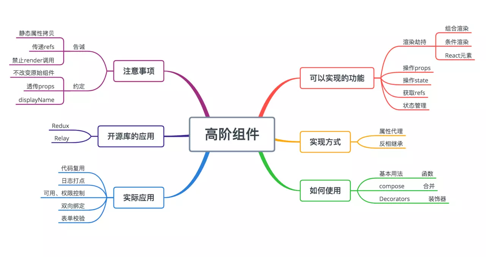

## 简介
> 高阶组件（HOC）是 React 中用于复用组件逻辑的一种高级技巧。HOC 自身不是 React API 的一部分，它是一种基于 React 的组合特性而形成的设计模式。

高阶组件可以看作React对装饰模式的一种实现，**高阶组件就是一个函数，且该函数接受一个组件作为参数，并返回一个新的组件**。

**语法**
```javascript
    const EnhancedComponent = higherOrderComponent(WrappedComponent);
```
可以从下面几个方面探索HOC。


**HOC的实现方式**
- 属性代理
- 反向继承

**高阶组件的使用场景**
- 组合渲染、条件渲染
- 操作 props(属性)
- 获取refs
- 组件状态提升
- 操作state
- 渲染劫持
- 用其他元素包裹 WrappedComponent

## HOC的实现方式
<font color="#ff502c"></font>
`React` 中实现 `HOC` 的两种主要方式：`Props Proxy`(属性代理)（PP）和 `Inheritance Inversion`(反向继承)(II) 。 两者都支持不同的方式来操作 **WrappedComponent** 。

这里不会详细介绍生命周期方法来做什么，因为它不是 `HOC` 的特性，而是 `React` 的特性。 但请注意，使用 `Inheritance Inversion(反向继承)`，您可以为 `WrappedComponent` 创建新的生命周期方法。 记得总是这样调用 `super[lifecycleHook]` ，这样就不会破坏 `WrappedComponent` 。

### 属性代理 Props Proxy
Props Proxy(属性代理)(PP) 以下列方式实现：
```javascript
    function ppHOC(WrappedComponent) {
        return class PP extends React.Component {
            render () {
                return <WrappedComponent {...this.props} />;
            }
        }
    }
```
这里的重要部分是HOC得render方法**返回**WrappedComponent类型的React元素。我们还通过HOC接收到得`props`(属性)，这就是名字`Props Proxy`的由来。

对比原生组件增强的项：
- 操作props
- 可操作组件的生命周期
- 通过 Refs 访问到组件实例
- 用其他元素包裹 WrappedComponent
- 提取 state(状态)

### Inheritance Inversion(反向继承)
Inheritance Inversion(反向继承)(II) 通过以下方式实现：
```javascript
    function iiHOC(WrappedComponent) {
        return class Enhancer extends WrappedComponent {
            render () {
                return super.render();
            }
        }
    }
```
返回的HOC类<font color="#ff502c">Enhancer</font> **继承（extends）了**WrappedComponent。它被成为<font color="#ff502c">Inheritance Inversion(反向继承)</font>，因为它不是用WrappedComponent来继承某些<font color="#ff502c">Enhancer</font>类。而是被<font color="#ff502c">Enhancer</font>被动继承。通过这种方式，他们之间的关系似乎是**反向（inverse）**。
<font color="#ff502c">反向继承</font>允许 <font color="#ff502c">HOC</font> 通过 <font color="#ff502c">this</font> 访问 <font color="#ff502c">WrappedComponent</font> 实例，这意味着它可以访问 <font color="#ff502c">state(状态)</font>，<font color="#ff502c">props(属性)</font>，<font color="#ff502c">组件生命周期方法</font>和 <font color="#ff502c">render</font> 方法。
对比原生组件增强的项：
- 可操作所有传入的props
- 可操作组件的生命周期
- 获取refs
- 可操作state
- 可以渲染劫持

## 高阶组件的使用场景
<hr/>

