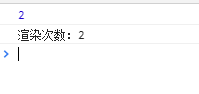

> [react的高阶组件浅析](/blog/react/react-hoc.html)
> [react中Hooks浅析](/blog/react/react-hooks.html)
> [react的mixins、hoc、hooks对比](/blog/react/react-mixins-hoc-hooks.html)

## 简介
> Hook 是 React 16.8 的新增特性。它可以让你在不编写 class 的情况下使用 state 以及其他的 React 特性。

我们知道，functional component在使用的时候有一些限制，比如需要生命周期、state的时候就不能用functional component。而有了Hooks，你就可以在funtional component里，使用class component的功能:props，state，context，refs，和生命周期函数等等。
**虽然Hooks已经有要取代正宫class的趋势了，但是react目前没有计划抛弃class，所以不要慌，你还是可以跟往常一样使用class。**
## 为什么引入hook
<hr/>

### 组件难以理解
<font color="#ff502c"></font>
在使用class组件构建我们的程序时，他们各自拥有自己的状态，业务逻辑的复杂使这些组件变得越来越庞大，各个<font color="#ff502c">生命周期</font>中会调用越来越多的逻辑，越来越难以维护。<font color="#ff502c">Hook</font> **将组件中相互关联的部分拆分成更小的函数（比如设置订阅或请求数据）**。而并非强制按照生命周期划分。你还可以使用 <font color="#ff502c">reducer</font> 来管理组件的内部状态，使其更加可预测。使用<font color="#ff502c">Hook</font>，可以让你更大限度的将<font color="#ff502c">公用逻辑</font>抽离，将一个组件分割成<font color="#ff502c">更小</font>的函数，而不是<font color="#ff502c">强制</font>基于生命周期方法进行分割。

### 组件嵌套问题
如果我们需要抽离一些重复的逻辑，就会选择 <font color="#ff502c">HOC</font> 或者 <font color="#ff502c">render props</font> 的方式。这种方式首先提高了 debug 的难度，并且也很难实现共享状态。
但是通过 <font color="#ff502c">Hooks</font> 的方式去抽离重复逻辑的话，一是不会增加组件的嵌套，二是可以实现状态的共享。

### 使用函数代替class
相比函数，编写一个<font color="#ff502c">class</font>可能需要掌握更多的知识，需要注意的点也越多，比如<font color="#ff502c">this</font>指向、绑定事件等等。另外，计算机理解一个函数比理解一个<font color="#ff502c">class</font>更快。<font color="#ff502c">Hooks</font>让你可以在<font color="#ff502c">class</font>之外使用更多React的新特性。

### 减少状态逻辑复用的风险
<font color="#ff502c">Hook</font>和<font color="#ff502c">Mixin</font>在用法上有一定的相似之处，但是<font color="#ff502c">Mixin</font>引入的<font color="#ff502c">逻辑</font>和<font color="#ff502c">状态</font>是可以<font color="#ff502c">相互覆盖</font>的，而多个<font color="#ff502c">Hook</font>之间互不影响，这让我们不需要在把一部分精力放在防止避免逻辑复用的冲突上。
在不遵守约定的情况下使用<font color="#ff502c">HOC</font>也有可能带来一定冲突，比如<font color="#ff502c">props覆盖</font>等等，使用Hook则可以避免这些问题。

### 函数组件无 this 问题
不需要通过<font color="#ff502c">bind</font>函数改变事件的<font color="#ff502c">this</font>指向问题。
## Hook API 索引
<hr/>

大致所有的<font color="#ff502c">hook</font>都在下面的列表中，但是比较重要的<font color="#ff502c">hook</font>是<font color="#ff502c">State Hook</font>、<font color="#ff502c">Effect Hook</font>这两个hook。
- 基础 Hook
  - useState
  - useEffect
  - useContext
- 额外的 Hook
  - [useReducer](https://react.docschina.org/docs/hooks-reference.html#usereducer)
  - useCallback
  - useMemo
  - useRef
  - [useImperativeHandle](https://react.docschina.org/docs/hooks-reference.html#useimperativehandle)
  - [useLayoutEffect](https://react.docschina.org/docs/hooks-reference.html#useLayoutEffect)
  - [useDebugValue](https://react.docschina.org/docs/hooks-reference.html#useDebugValue)

### State Hook、Effect Hook
- State Hook(useState 通过在函数组件里调用它来给组件添加一些内部 state。)
- Effect Hook (useEffect 就是一个 Effect Hook，给函数组件增加了操作副作用的能力。)

### useState
**语法**
```javascript
export default function UseStateHook () {
    const [count, setCount] = useState(0);
    return(
        <div>
            <p>You clicked {count} times</p>
            <button onClick={() => setCount(count + 1)}>
                Click me
            </button>
        </div>
    );
}
```
通过useState()返回的状态 (count) 与传入的第一个参数 (initialState) 值相同。
> **注意** React 会确保 setState 函数的标识是稳定的，并且不会在组件重新渲染时发生变化。这就是为什么可以安全地从 useEffect 或 useCallback 的依赖列表中省略 setState。

**函数式更新**

同时也会返回更新state函数setCount,两种用法直接传要更新的值，也可以传fucntion但是要return出要更新的值。
```javascript
    <button onClick={() => setCount(1)}>
        Click me
    </button>
    <button onClick={() => setCount(prevCount => prevCount + 1)}>
        Click me
    </button>
```
> **注意** 与 class 组件中的 setState 方法不同，useState 不会自动合并更新对象。你可以用函数式的 setState 结合展开运算符来达到合并更新对象的效果。
```javascript
setState(prevState => {
    // 也可以使用 Object.assign
    return {...prevState, ...updatedValues};
});
```
>   useReducer 是另一种可选方案，它更适合用于管理包含多个子值的 state 对象。

**惰性初始 state**

**initialState** 参数只会在组件的**初始渲染**中起作用，后续渲染时会被**忽略**。也可以传入一个**函数**计算并返回初始的state。
```javascript
    const [count setCount] = useSate(() => {
        const { porps } = this;
        const initialState = porps + 1;
        return initialState;
    });
```

### useEffect
<font color="#ff502c">useEffect</font> 就是一个 <font color="#ff502c">Effect Hook</font>，给函数组件增加了操作副作用的能力。它跟 <font color="#ff502c">class</font> 组件中的 <font color="#ff502c">componentDidMount</font>、<font color="#ff502c">componentDidUpdate</font> 和 <font color="#ff502c">componentWillUnmount</font> 具有相同的用途，只不过被合并成了一个 <font color="#ff502c">API</font>。（我们会在使用 <font color="#ff502c">Effect Hook</font> 里展示对比 <font color="#ff502c">useEffect</font> 和这些方法的例子。）

**语法**
<font color="#ff502c">useEffect</font>方法接收传入两个参数：
- 1.回调函数：在第组件一次<font color="#ff502c">render</font>和之后的每次<font color="#ff502c">update</font>后运行，<font color="#ff502c">React</font>保证在<font color="#ff502c">DOM已经更新完成</font>之后才会运行回调。
- 2.状态依赖(数组)：当配置了状态依赖项后，只有检测到配置的状态变化时，才会调用回调函数。

```javascript
    useEffect(() => {
        // 只要组件render后就会执行
    });
    useEffect(() => {
        // 只有count改变时才会执行
    },[count]);
```

**清除 effect**
```javascript
useEffect(() => {
  const subscription = props.source.subscribe();
  return () => {
    // 清除订阅
    subscription.unsubscribe();
  };
});
```
为防止内存泄漏，清除函数会在组件卸载前执行。另外，如果组件多次渲染（通常如此），则在**执行下一个 effect 之前，上一个 effect 就已被清除**。

**effect 的执行时机**
与 <font color="#ff502c">componentDidMount</font>、<font color="#ff502c">componentDidUpdate</font> 不同的是，在浏览器完成布局与绘制之后，传给 <font color="#ff502c">useEffect</font> 的函数会延迟调用。
虽然 <font color="#ff502c">useEffect</font> 会在浏览器绘制后延迟执行，但会保证在<font color="#ff502c">任何新</font>的<font color="#ff502c">渲染前</font>执行。<font color="#ff502c">React</font> 将在组件更新前刷新上一轮渲染的 effect。

```javascript
export default function UseStateHook() {
  const [count, setCount] = useState(0);
  useEffect(() => {
    console.log('执行...', count);
    return () => {
      console.log('清理...', count);
    }
  }, [count]);
  return (
    <div>
      <p>You clicked {count} times</p>
      <button onClick={() => { setCount(count + 1); }}>
        Click me
        </button>
    </div>
  );
}
```
执行上面的代码，并且点击几次按钮，执行顺序如下：

如果我们加上浏览器渲染，他会在页面渲染之执行，运行如下：

**模拟componentDidMount**

<font color="#ff502c">componentDidMount</font>等价于<font color="#ff502c">useEffect</font>的回调仅在页面初始化完成后执行一次，当<font color="#ff502c">useEffect</font>的第二个参数传入一个空数组时可以实现这个效果。
```javascript
    function useDidMount(callback) {
        useEffect(callback, []);
    }
```
> 官方不推荐上面这种写法，因为这有可能导致一些错误。

**模拟componentWillUnmount**
```javascript
    function useUnMount(callback) {
        useEffect(() => callback, []);
    }
```
> 不像 componentDidMount 或者 componentDidUpdate，useEffect 中使用的 effect 并不会阻滞浏览器渲染页面。这让你的 app 看起来更加流畅。

### useContext
**语法**
```javascript
    const value = useContext(MyContext);
```
接收一个 <font color="#ff502c">context</font> 对象（<font color="#ff502c">React.createContext</font> 的返回值）并返回该 <font color="#ff502c">context</font> 的当前值。当前的 <font color="#ff502c">context</font> 值由上层组件中距离当前组件最近的 <font color="#ff502c"><MyContext.Provider></font> 的 <font color="#ff502c">value prop</font> 决定。

[context的使用请看另一篇博客](/blog/react/react-context.html)
```javascript
    // Context 可以让我们无须明确地传遍每一个组件，就能将值深入传递进组件树。
    // 为当前的 theme 创建一个 context（“light”为默认值）。
    const ThemeContext = React.createContext('light');

    class APP extends React.Component {
        render () {
            // 使用一个 Provider 来将当前的 theme 传递给以下的组件树。
            // 无论多深，任何组件都能读取这个值。
            // 在这个例子中，我们将 “dark” 作为当前的值传递下去。
            return (
                <ThemeContext.Provider value="drak">
                    <Toolbar />
                </ThemeContext.Provider>
            );
        }
    }

    // 中间的组件再也不必指明往下传递 theme 了。
    function Toolbar(props) {
        return (
            <div>
            <ThemedButton />
            </div>
        );
    }

    class ThemedButton extends React.Component {
        // 指定 contextType 读取当前的 theme context。
        // React 会往上找到最近的 theme Provider，然后使用它的值。
        // 在这个例子中，当前的 theme 值为 “dark”。
        static contextType = ThemeContext;
        render () {
            return <Button theme={this.context}/>
        }
    }
```
重写ThemeButton组件，用useContext形式：
```javascript
    function ThemeButton () {
        const theme = useContext(ThemeContext);
        return (
            <Button theme={theme}/>
        );
    }
```
别忘记 <font color="#ff502c">useContext</font> 的参数必须是 <font color="#ff502c">context</font> 对象本身：
- 正确： useContext(ThemeContext)
- 错误： useContext(ThemeContext.Consumer)
- 错误： useContext(ThemeContext.Provider)

调用了 <font color="#ff502c">useContext</font> 的组件总会在 <font color="#ff502c">context</font> 值变化时重新渲染。如果重渲染组件的开销较大，你可以 [通过使用 memoization 来优化](https://github.com/facebook/react/issues/15156#issuecomment-474590693)。

> 如果你在接触 <font color="#ff502c">Hook</font> 前已经对 <font color="#ff502c">context API</font> 比较熟悉，那应该可以理解，**useContext(MyContext)** 相当于 class 组件中的 **static contextType = MyContext** 或者 **<MyContext.Consumer>**。

useContext(MyContext) 只是让你能够读取 <font color="#ff502c">context</font> 的值以及订阅 <font color="#ff502c">context</font> 的变化。你仍然需要在上层组件树中使用 <MyContext.Provider> 来为下层组件提供 c<font color="#ff502c">ontext</font>。

### useCallback
如果你需要一个不会随着组件更新而重新创建的 callback


### useMemo
<font color="#ff502c">useMemo</font> 可以用来优化函数组件重渲染的性能。函数组价有[React.memo(高阶组件)](https://zh-hans.reactjs.org/docs/react-api.html#reactmemo)，它类似类组件的[React.PureComponent](https://zh-hans.reactjs.org/docs/react-api.html#reactpurecomponent)；它们都是React的顶层API。

**useMemo 与 memo**
<font color="#ff502c">React.memo</font>针对的是一个函数组件的渲染是否重复执行，而 <font color="#ff502c">useMemo</font> 定义的是一个函数逻辑是否重复执行。

**语法**
它的语法和<font color="#ff502c">useEffect</font>很像，把“创建”函数和依赖项数组作为参数传入 <font color="#ff502c">useMemo</font>。
参数：
- 第一个参数是是需要执行的逻辑函数
- 第二个参数是这个逻辑依赖输入变量组成的数组，如果不传每次都会执行逻辑函数， 传入空数组只会执行一次。（非必传）

```javascript
import React, { useState, useMemo } from 'react';
function Counter () {
  const [count, setCount] = useState(0);
  const renderCount = useMemo(() => {
    console.log(count);
    console.log('渲染次数：' + count);
    return '渲染次数：' + count;
  }, [count]);
  return (
    // eslint-disable-next-line react/react-in-jsx-scope
    <div>
      <button type="button" onClick={() => {setCount(count + 1)}}>
        计数按钮
      </button>
      <p>{renderCount}</p>
      <p>{count}</p>
    </div>
  );
}
export default Counter;
```
运行结果如下：

可以在依赖输入做判断优化渲染次数：
```javascript
  const renderCount = useMemo(() => {
    console.log(count);
    console.log('渲染次数：' + count);
    return '渲染次数：' + count;
  }, [count === 2]);
```

**你可以把 useMemo 作为性能优化的手段，但不要把它当成语义上的保证。**
> 注意 依赖项数组不会作为参数传给“创建”函数。然虽然从概念上来说它表现为：所有“创建”函数中引用的值都应该出现在依赖项数组中。未来编译器会更加智能，届时自动创建数组将成为可能。
我们推荐启用 eslint-plugin-react-hooks 中的 exhaustive-deps 规则。此规则会在添加错误依赖时发出警告并给出修复建议。

### useRef
useRef 返回一个可变的 ref 对象，使用useRef Hook，你可以轻松的获取到dom的ref。
useRef 主要有两个使用场景：
- 获取子组件或者 DOM 节点的句柄
- 渲染周期之间的共享数据的存储
大家可能会想到 state 也可跨越渲染周期保存，但是 state 的赋值会触发重渲染，但是 ref 不会，从这点看 ref 更像是类属性中的普通成员。
```javascript
function TextInputWithFocusButton() {
  const inputEl = useRef(null);
  const onButtonClick = () => {
    // `current` 指向已挂载到 DOM 上的文本输入元素
    inputEl.current.focus();
  };
  return (
    <>
      <input ref={inputEl} type="text" />
      <button onClick={onButtonClick}>Focus the input</button>
    </>
  );
}
```
useRef() 和自建一个 {current: ...} 对象的唯一区别是，useRef 会在每次渲染时返回同一个 ref 对象。

**模拟实现ComponentDidUpdate**
componentDidUpdate就相当于除去第一次调用的useEffect，我们可以借助useRef生成一个标识，来记录是否为第一次执行：
```javascript
  function useDidUpdate(callback, prop) {
  const init = useRef(true);
  useEffect(() => {
    if (init.current) {
      init.current = false;
    } else {
      return callback();
    }
  }, prop);
}
```
> 请记住，当 ref 对象内容发生变化时，useRef 并不会通知你。变更 .current 属性不会引发组件重新渲染。如果想要在 React 绑定或解绑 DOM 节点的 ref 时运行某些代码，则需要使用回调 ref 来实现。

## hook使用事项
**Hook 本质就是 JavaScript 函数，但是在使用它时需要遵循两条规则。**

### 只在最顶层使用 Hook
<font color="#ff502c">不要</font>在<font color="#ff502c">循环，条件或嵌套函数</font>中<font color="#ff502c">调用 Hook</font>， 确保总是在你的 <font color="#ff502c">React 函数的最顶层调用</font>他们。

### 使用范围
<font color="#ff502c">不要</font>在<font color="#ff502c">普通的 JavaScript 函数中</font>调用 Hook。只能在<font color="#ff502c"> React 的函数组件中调用 Hook</font>。不要在其他 JavaScript 函数中调用。
**Hook的提出主要就是为了解决class组件的一系列问题，所以我们能在class组件中使用它**。

## 参考
> [Hook 概览](https://react.docschina.org/docs/hooks-overview.html)
> [Hook API 索引](https://react.docschina.org/docs/hooks-reference.html)
> [从Mixin到HOC再到Hook](https://juejin.im/post/5cad39b3f265da03502b1c0a#heading-40)
> [React 新特性 Hooks 讲解及实例(三)](https://mp.weixin.qq.com/s/PmACWd4XvwXZXuTXggdhsw)
> [React 新特性 Hooks 讲解及实例(四)](https://mp.weixin.qq.com/s/Tm7_JvMxSOvzsIXgx0rmYQ)