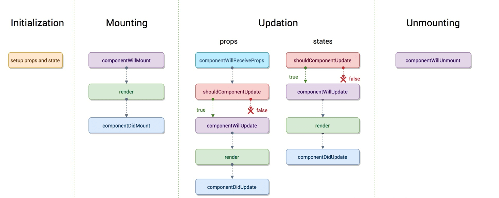

## 简介
在<font color="#ff502c">react</font> v16.x对生命周期有比较大的变化，可以通过下面的两张比较经典的图片来一览变化。
**react v15.x**

**react v16.x**


<font color="#ff502c">react</font> v16.x的生命周期是在 react v15.x的生命周期基础上删减了一些生命周期，同时也新增了一些生命周期，删除的生命周期也可以通过hook来模拟实现。

**React 16.3 新增的生命周期方法**
- **getDerivedStateFromProps()**
- **getSnapshotBeforeUpdate()**

**逐渐废弃的生命周期方法**
- **componentWillMount()**
- **componentWillReceiveProps()**
- **componentWillUpdate()**

> 虽然废弃了这三个生命周期方法，但是为了向下兼容，将会做渐进式调整。（详情见#12028）
V16.3 并未删除这三个生命周期，同时还为它们新增以 UNSAFE_ 前缀为别名的三个函数 <font color="#ff502c">UNSAFE_componentWillMount()</font>、<font color="#ff502c">UNSAFE_componentWillReceiveProps()</font>、<font color="#ff502c">UNSAFE_componentWillUpdate()</font>。
在 16.4 版本给出警告将会弃用 <font color="#ff502c">componentWillMount()</font>、<font color="#ff502c">componentWillReceiveProps()</font>、<font color="#ff502c">componentWillUpdate()</font> 三个函数
然后在 17 版本将会删除 <font color="#ff502c">componentWillMount()</font>、<font color="#ff502c">componentWillReceiveProps()</font>、<font color="#ff502c">componentWillUpdate()</font> 这三个函数，会保留使用 <font color="#ff502c">UNSAFE_componentWillMount()</font>、<font color="#ff502c">UNSAFE_componentWillReceiveProps()</font>、<font color="#ff502c">UNSAFE_componentWillUpdate()</font>

一般生命周期分为三个阶段：
1. 创建阶段（Mounting）
2. 更新阶段（Updating）
3. 卸载阶段（UnMounting）

从 React v16.x 开始，还对生命周期加入了错误处理（Error Handling）。

## 生命周期
其实用下面的这个图更能展现v15.x的流程图三个阶段的生命周期，图如下：


## 挂载(Mounting)阶段
- constructor
- static getDerivedStateFromProps()(**新增**)
- componentWillMount()/UNSAFE_componentWillMount()(**废弃**)
- render()
- componentDidMount()

### constructor()
对于每个组件实例这个方法只会调用**一次**。
<font color="#ff502c">constructor参数接受两个参数**props**，**context**。
```javascript
  constructor(props, context) {
    super(props, context);
    console.log(this.props,this.context);
  };
```
可以获取到父组件传下来的的**props**,**context**,如果你想在<font color="#ff502c">constructor</font>构造函数内部(注意是内部哦，在组件其他地方是可以直接接收的)使用**props**或**context**,则需要传入，并传入<font color="#ff502c">super</font>对象。


构造函数通常用于：
  - 使用 **this.state** 来初始化 **state**
  - 给事件处理函数绑定 **this**

> ES6 子类的构造函数必须执行一次 <font color="#ff502c">super</font>。React 如果构造函数中要使用 **this.props**，必须先执行 super(props)。

### static getDerivedStateFromProps(nextProps, prevState)
`
static getDerivedStateFromProps(nextProps, prevState)
`
首先，这是一个静态方法生命周期钩子。也就是说，定义的时候得在方法前加一个`static`关键字，或者直接挂载到`class`类上。

简要区分一下实例方法和静态方法：
- 实例方法，挂载在this上或者挂载在prototype上，class类不能直接访问该方法，使用new关键字实例化之后，实例可以访问该方法。
- 静态方法，直接挂载在class类上，或者使用新的关键字static，实例无法直接访问该方法。

当<font color="#ff502c">创建时</font>、<font color="#ff502c">接收新的 props 时</font>、<font color="#ff502c">setState 时</font>、<font color="#ff502c">forceUpdate 时</font>会执行这个方法。
> 注意：v16.3 setState 时、forceUpdate 时不会执行这个方法，v16.4 修复了这个问题。

这个生命周期钩子也经历了一些波折，原本它是被设计成<font color="#ff502c">初始化</font>、<font color="#ff502c">父组件更新</font>和<font color="#ff502c">接收到props</font>才会触发，现在只要渲染就会触发，也就是<font color="#ff502c">初始化</font>和<font color="#ff502c">更新阶段</font>都会触发。

```javascript
class ExampleComponent extends React.Component {
  // Initialize state in constructor,
  // Or with a property initializer.
  state = {
    isScrollingDown: false,
    lastRow: null,
  };

  static getDerivedStateFromProps(props, state) {
    if (props.currentRow !== state.lastRow) {
      return {
        isScrollingDown: props.currentRow > state.lastRow,
        lastRow: props.currentRow,
      };
    }

    // Return null to indicate no change to state.
    return null;
  }
}
```
这个方法在建议尽量少用，只在必要的场景中使用，一般使用场景如下：
- 无条件的根据 `props` 更新 `state`
- 当 `props` 和 `state` 的不匹配情况更新 `state`

### componentWillMount
- 组件刚经历<font color="#ff502c">constructor</font>,初始完数据
- 组件还未进入<font color="#ff502c">render</font>，组件还未渲染完成，dom还**未渲染**

在组件**挂载**到DOM前调用，且只会被调用一次，在这边调用this.setState不会引起组件重新渲染（**如果是异步的话，会触发重新渲染**）。
> 这是React不再推荐使用的API。

### render（会多次执行）
该方法会创建一个**vnode**，用来表示组件的输出。对于一个组件来讲，<font color="#ff502c">render</font>方法是唯一一个必需的方法。<font color="#ff502c">render</font>方法需要满足下面几点：
1. 只能通过 **this.props** 和 **this.state** 访问数据（不能修改）
2. 可以返回 null,false 或者任何<font color="#ff502c">React</font>组件
3. 只能出现一个顶级组件，不能返回一组元素
4. 不能改变组件的状态(**state**)
5. 不能修改DOM的输出

可以返回下面几种类型：

### componentDidMount
组件挂载到DOM后调用，且只会被调用一次。
一般用于下面的场景：
- 异步请求 ajax
- 添加事件绑定（注意在 <font color="#ff502c">componentWillUnmount</font> 中取消，以免造成内存泄漏）

## 更新(update)阶段
- componentWillReceiveProps()/UNSAFE_componentWillReceiveProps()(**废弃**)
- static getDerivedStateFromProps()(**新增**)
- shouldComponentUpdate(nextProps,nextState)
- componentWillUpdate(nextProps, nextState)/UNSAFE_componentWillUpdate(nextProps, nextState)(**废弃**)
- render()
- static getSnapshotBeforeUpdate()(**新增**)
- componentDidUpdate()

造成组件更新有两类(两种)：
- **调用setState**
 1. 组件本身调用setState，无论state有没有变化。可通过shouldComponentUpdate方法优化。
 ```javascript
  class Child extends Component {
   constructor(props) {
        super(props);
        this.state = {
          someThings: 1
        }
   }
   shouldComponentUpdate(nextStates){ // 应该使用这个方法，否则无论state是否有变化都将会导致组件重新渲染
        if(nextStates.someThings === this.state.someThings){
          return false
        }
    }
   handleClick = () => { // 虽然调用了setState ，但state并无变化
        const preSomeThings = this.state.someThings
         this.setState({
            someThings: preSomeThings
         })
   }
    render() {
        return <div onClick = {this.handleClick}>{this.state.someThings}</div>
    }
}
```

- 父组件重新render
  1. 直接使用,每当父组件重新render导致的重传props，子组件将直接跟着重新渲染，无论props是否有变化。可通过shouldComponentUpdate方法优化。

优化同上。

### componentWillReceiveProps (nextProps)
componentWillReceiveProps</font>在接受父组件改变后的**props**需要重新渲染组件。
它接受一个参数：
- nextProps **通过对比nextProps和this.props，将nextProps setState为当前组件的state，从而重新渲染组件**

该声明周期函数可能在两种情况下被触发：
- 组件接收到了新的属性。
- 组件没有收到新的属性，但是由于父组件重新渲染导致当前组件也被重新渲染。
同样，因为Fiber机制的引入，这个生命周期钩子有可能会多次触发。

### static getDerivedStateFromProps()
见上文`static getDerivedStateFromProps()`

### shouldComponentUpdate(nextProps,nextState)
在接收新的 props 或新的 state 时，在渲染前会触发该方法。该方法通过返回 true（触发重新渲染） 或者 false（不会触发重新渲染） 来确定是否需要触发新的渲染。
但是官方提倡我们使用PureComponent来减少重新渲染的次数而不是手工编写shouldComponentUpdate代码。因为未来版本shouldComponentUpdate返回false，仍然可能导致组件重新的渲染。
> Currently, if shouldComponentUpdate() returns false, then UNSAFE_componentWillUpdate(), render(), and componentDidUpdate() will not be invoked. In the future React may treat shouldComponentUpdate() as a hint rather than a strict directive, and returning false may still result in a re-rendering of the component.

> PureComponent自动实现了一个shouldComponentUpdate生命周期钩子。(浅比较)

### componentWillUpdate(nextProps, nextState)/UNSAFE_componentWillUpdate(nextProps, nextState)
当接收到新的 `props` 或 `state` 时，在渲染前执行该方法。在这个方法中不能调用`setState`，因为这样会导致`整个`生命周期`混乱`。
因为在异步渲染中，可能会导致网络请求多次，引起一些性能问题，同事在这其中获取一些dom信息是不能保证准确性。

> 因为Fiber机制的引入，这个生命周期钩子有可能会多次调用。

### static getSnapshotBeforeUpdate(prevProps, prevState)
这个方法在 <font color="#ff502c">render()</font> 之后，<font color="#ff502c">componentDidUpdate()</font> 之前调用。
两个参数<font color="#ff502c"> prevProps</font> 表示更新前的 <font color="#ff502c">props</font>，<font color="#ff502c">prevState</font> 表示更新前的 <font color="#ff502c">state</font>返回值称为一个快照（snapshot），如果不需要 <font color="#ff502c">snapshot</font>，则必须显示的返回 <font color="#ff502c">null</font> —— 因为返回值将作为 <font color="#ff502c">componentDidUpdate()</font> 的第三个参数使用。所以这个函数必须要配合 <font color="#ff502c">componentDidUpdate()</font> 一起使用。
比如记录滚动的高度，代码如下：
```javascript
  class ScrollingList extends React.Component {
    constructor(props) {
      super(props);
      this.listRef = React.createRef();
    }

    getSnapshotBeforeUpdate(prevProps, prevState) {
      // Are we adding new items to the list?
      // Capture the scroll position so we can adjust scroll later.
      if (prevProps.list.length < this.props.list.length) {
        const list = this.listRef.current;
        return list.scrollHeight - list.scrollTop;
      }
      return null;
    }

    componentDidUpdate(prevProps, prevState, snapshot) {
      // If we have a snapshot value, we've just added new items.
      // Adjust scroll so these new items don't push the old ones out of view.
      // (snapshot here is the value returned from getSnapshotBeforeUpdate)
      if (snapshot !== null) {
        const list = this.listRef.current;
        list.scrollTop = list.scrollHeight - snapshot;
      }
    }

    render() {
      return (
        <div ref={this.listRef}>{/* ...contents... */}</div>
      );
    }
  }
```

### componentDidUpdate(prevProps, prevState, snapshot)
该方法在getSnapshotBeforeUpdate方法之后被调用，有三个参数prevProps，prevState，snapshot，表示之前的props，之前的state，和snapshot。第三个参数是getSnapshotBeforeUpdate返回的，所有getSnapshotBeforeUpdate时，必须要有componentDidUpdate。

> 可以使用 setState，会触发 render，所以要注意判断，避免导致死循环。

## 卸载阶段（Unmounting）
- componentWillUnmount

### componentWillUnmount
在组件卸载或者销毁前调用。这个方法主要用来做一些清理工作，例如：
- 取消事件绑定
- 订阅器
- 定时器

> 不能使用 setState

## 错误处理 Error Handling
> 这是React v16.3.0发布的API。
- componentDidCatch(err, info)

任何子组件在渲染期间，生命周期方法中或者构造函数 constructor 发生错误时调用。
它主要用来捕获错误并进行相应处理，所以它的用法也比较特殊。但是它不能捕获下面的错误：

- 事件处理 (Event handlers) （因为事件处理不发生在 React 渲染时，报错不影响渲染）
- 异步代码 (Asynchronous code) (e.g. setTimeout or requestAnimationFrame callbacks)
- 服务端渲染 (Server side rendering)
- 错误边界本身(而不是子组件)抛出的错误

## 组件树生命周期调用顺序
应用初次挂载时，我们以<font color="#ff502c">render</font>和<font color="#ff502c">componentDidMount</font>为例，React首先会调用根组件的<font color="#ff502c">render</font>钩子，如果有子组件的话，依次调用子组件的<font color="#ff502c">render</font>钩子，调用过程其实就是<font color="#ff502c">递归</font>的顺序。

等所有组件的render钩子都递归执行完毕，这时候执行权在最后一个子组件手里，于是开始触发下一轮生命周期钩子，调用最后一个子组件的componentDidMount钩子，然后调用栈依次往上递归。


```javascript
app.render();
child.render();
grandson.render();
// divide
grandson.componentDidMount();
child.componentDidMount();
app.componentDidMount();
// divide
app.render();
child.render();
grandson.render();
// divide
grandson.componentDidUpdate();
child.componentDidUpdate();
app.componentDidUpdate();

```

## V16 生命周期函数用法建议
```javascript
class ExampleComponent extends React.Component {
  // 用于初始化 state
  constructor() {}
  // 用于替换 `componentWillReceiveProps` ，该函数会在初始化和 `update` 时被调用
  // 因为该函数是静态函数，所以取不到 `this`
  // 如果需要对比 `prevProps` 需要单独在 `state` 中维护
  static getDerivedStateFromProps(nextProps, prevState) {}
  // 判断是否需要更新组件，多用于组件性能优化
  shouldComponentUpdate(nextProps, nextState) {}
  // 组件挂载后调用
  // 可以在该函数中进行请求或者订阅
  componentDidMount() {}
  // 用于获得最新的 DOM 数据
  getSnapshotBeforeUpdate() {}
  // 组件即将销毁
  // 可以在此处移除订阅，定时器等等
  componentWillUnmount() {}
  // 组件销毁后调用
  componentDidUnMount() {}
  // 组件更新后调用
  componentDidUpdate() {}
  // 渲染组件函数
  render() {}
  // 以下函数不建议使用
  UNSAFE_componentWillMount() {}
  UNSAFE_componentWillUpdate(nextProps, nextState) {}
  UNSAFE_componentWillReceiveProps(nextProps) {}
}
```

## 参考
> [React专题：生命周期](https://juejin.im/post/5b7e0647e51d455d18400ef7#heading-10)
> [重新认识 React 生命周期](https://blog.hhking.cn/2018/09/18/react-lifecycle-change/)
> [详解React生命周期(包括react16版)](https://www.jianshu.com/p/514fe21b9914)