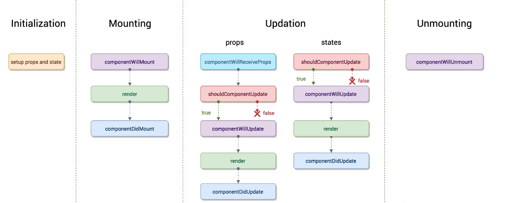
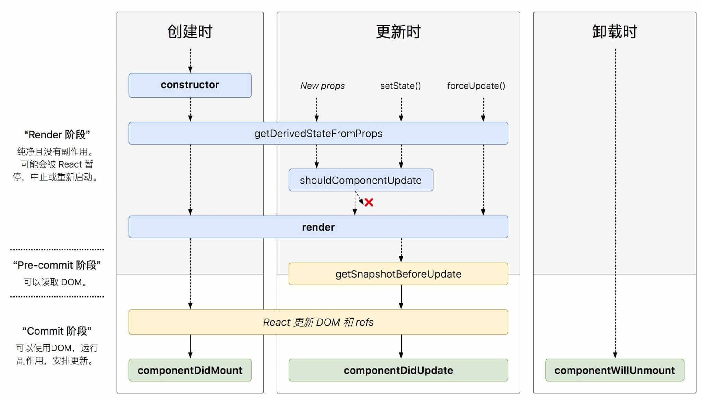

## 简介
在react v16.x对生命周期有比较大的变化，可以通过下面的两张比较经典的图片来一览变化。
**react v15.x**

**react v16.x**

react v16.x的生命周期是在 react v15.x的生命周期基础上删减了一些生命周期，同时也新增了一些生命周期，删除的生命周期也可以通过hook来模拟实现。

**React 16.3 新增的生命周期方法**
- **getDerivedStateFromProps()**
- **getSnapshotBeforeUpdate()**

**逐渐废弃的生命周期方法**
- **componentWillMount()**
- **componentWillReceiveProps()**
- **componentWillUpdate()**

> 虽然废弃了这三个生命周期方法，但是为了向下兼容，将会做渐进式调整。（详情见#12028）
V16.3 并未删除这三个生命周期，同时还为它们新增以 UNSAFE_ 前缀为别名的三个函数 UNSAFE_componentWillMount()、UNSAFE_componentWillReceiveProps()、UNSAFE_componentWillUpdate()。
在 16.4 版本给出警告将会弃用 componentWillMount()、componentWillReceiveProps()、componentWillUpdate() 三个函数
然后在 17 版本将会删除 componentWillMount()、componentWillReceiveProps()、componentWillUpdate() 这三个函数，会保留使用 UNSAFE_componentWillMount()、UNSAFE_componentWillReceiveProps()、UNSAFE_componentWillUpdate()

一般生命周期分为三个阶段：
1. 创建阶段（Mounting）
2. 更新阶段（Updating）
3. 卸载阶段（UnMounting）

从 React v16.x 开始，还对生命周期加入了错误处理（Error Handling）
