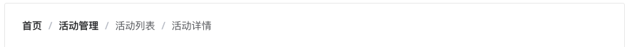
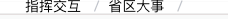

## 简介

---

我们开始只关注组件的功能实现，不考虑css分装、webpack配置、整体结构设计、单元测试等等，因为在后面会一步一步完善。让大家一起进步，实现一套简单的组件库。

在日常我们开发PC页面时经常会用到一个面包屑导航的功能，其实这个功能算是比较简单的功能，基本上用过`Vue`这个框架的人都能自己写出来。但是既然要写一个通用的可能就不是那么容易实现，我们首先要了解`Breadcrumb`它都有什么功能。下面我们就先分析它都有什么功能，可以参考`element/iview`这种流行的`Ui框架`。

1. 分析`Breadcrumb`组件功能
2. 构思代码、编写代码
3. 测试组件效果，编写单元测试

按照上面的三步一步一步的实现自己一个自己`Breadcrumb`组件，废话不多说直接开干。

## 分析组件功能

我们可以去`element/iview`官方网去阅读一下他们的[文档](https://element.eleme.cn/2.13/#/zh-CN/component/breadcrumb)，在去`github`中看一下他们的源码。首先看一下他们是怎么使用，下面以`element`为例。
**示例**

```html
  <el-breadcrumb separator="/">
    <el-breadcrumb-item :to="{ path: '/' }">首页</el-breadcrumb-item>
    <el-breadcrumb-item><a href="/">活动管理</a></el-breadcrumb-item>
    <el-breadcrumb-item>活动列表</el-breadcrumb-item>
    <el-breadcrumb-item>活动详情</el-breadcrumb-item>
  </el-breadcrumb>
```

效果图：


根据上面和代码我们可以看出`Breadcrumb`有两个组件，分别为：

`breadcrumb`组件，并且它接受两个`props`属性：

- `sparator(props)`: 它是用来替换默认`/`分隔符的，并且它的类型为`String`类型。默认`/`
- `sparatorClass(props)`: 它是用来给填充`iconfont`这种的图标分隔符，并且它的类型为`String`类型。没有默认值

`breadcrumb-item`组件，它是被`breadcrumb`包裹的组件，它也接受两个`props`属性：

- `to(props)`: 路由跳转对象，同 `vue-router` 的 `to`, 并且它的类型为`String/Object`类型。没有默认值
- `replace(props)`: 在使用 `to` 进行路由跳转时，启用 `replace` 将不会向 `history` 添加新记录, 类型是`Boolean`。默认`false`

我们大致知道了有两个组件，组件之间有嵌套关系，并且分别都支持两个`props`参数。并且有的`props`还有默认参数。下面我们就来一步一步实现自己已经知道的功能和配置。

## 实现组件

这里面有两个比较重要的知识点：

- `breadcrumb-item`可以通过`slot`传入`breadcrumb`，同时`breadcrumb-item`中的内容也通过`slot`传入内容
- `breadcrumb`中接受的两个`props`怎么传入`breadcrumb-item`。 当然可以通过`props`一层一层传入，但是我们要写的好一点，这个里可以通过两种方式实现。`provide/inject`和`this.$children`来实现，这两种实现方式分别是`element`、`iview`实现方式，个人认为`provide/inject`更简洁一点。

### 第一步

一个简单的组件`**breadcrumb**`

```html
<template>
  <div class="breadcrumb">
    <slot></slot>
  </div>
</template>
<script>
export default {
  name: 'Breadcrumb',
  props: {
    // 分隔符
    separator: {
      type: String,
      default: '/'
    },
    // 分隔符
    separatorClass: {
      type: String,
      default: ''
    }
  },
  /**
   * TODO: 通过provide注入当前组件实例
   * @return {Object} 返回一个对象
   */
  provide () {
    return {
      breadcrumbEl: this
    }
  },
  mounted () { }
}
</script>
<style lang="scss" scoped>
.clearfix {
  &::after, &::before {
   content: '';
   display: table;
  }
  &::after {
    clear: both
  }
}
.breadcrumb {
  font-size: 14px;
  line-height: 1;
  @extend .clearfix;
}
</style>

```

另一个组件`**breadcrumb-item**`

```html
<template>
  <span
    class="breadcrumb-item"
  >
    <span :class="['breadcrumb-inner']">
      <slot />
    </span>
    <span class="breadcrumb-separator">
      {{ separator }}
    </span>
  </span>
</template>
<script>
export default {
  name: 'BreadcrumbItem',
  props: {
    // 跳转路径
    // eslint-disable-next-line vue/require-default-prop
    to: [String, Object],
    // 是否使用repalce替换push跳转
    replace: Boolean
  },
  data: function () {
    return {
      // TODO: 接受父组件传入的 分隔符
      separator: '',
      // TODO: 接受父组件传入的 分隔符 class
      separatorClass: ''
    }
  },
  // TODO: 通过inject接受父组件注入的对象
  inject: ['breadcrumbEl'],
  mounted () {
    this.separator = this.breadcrumbEl.separator
    this.separatorClass = this.breadcrumbEl.separatorClass
    console.log('this.breadcrumbEl: ', this.breadcrumbEl)
  }
}
</script>
<style lang="scss" scoped>
.breadcrumb {
  @at-root #{&}-item {
    float: left;
  }
  @at-root #{&}-separator {
    margin: 0 9px;
    font-weight: 700;
    color: #c0c4cc;
  }
}
</style>
```

到此我们至少实现了基本的功能，如下图所示：


### 第二步

但是我们观察这个图片可以看到，我们还是有一部分功能没有实现，如下几点：

- 组件的后面多了一个`/`
- 当前的组件不能跳转，增加跳转
- 添加属性无障碍阅读

我们在`breadcrumb`组件中添加如下代码：

```js
  // 新增代码
  mounted () {
    // 获取所有的面包屑子项
    const items = this.$el.querySelectorAll('.breadcrumb-item')
    // 判断子节点的长度
    if (items.length) {
      // 如果最后一个添加aria 属性
      items[items.length - 1].setAttribute('aria-current', 'page')
    }
  }
```

我们在`breadcrumb-item`组件中添加如下代码。

```html
<template>
  <span
    class="breadcrumb-item"
  >
    <span
      ref="link"
      :class="['breadcrumb-inner', to ? 'is-link': '']"
    >
      <slot />
    </span>
    <i
      v-if="separatorClass"
      class="breadcrumb-separator"
      :class="separatorClass"
    />
    <span
      v-else
      class="breadcrumb-separator"
      role="presentation"
    >
      {{ separator }}
    </span>
  </span>
</template>
<script>
export default {
  name: 'BreadcrumbItem',
  props: {
    // 跳转路径
    to: [String, Object],
    // 是否使用repalce替换push跳转
    replace: Boolean
  },
  data: function () {
    return {
      // TODO: 接受父组件传入的 分隔符
      separator: '',
      // TODO: 接受父组件传入的 分隔符 class
      separatorClass: ''
    }
  },
  // TODO: 通过inject接受父组件注入的对象
  inject: ['breadcrumbEl'],
  mounted () {
    this.separator = this.breadcrumbEl.separator
    this.separatorClass = this.breadcrumbEl.separatorClass
    // 获取当前Link实例
    let linkEl = this.$refs.link
    linkEl.setAttribute('role', 'link')
    linkEl.addEventListener('click', event => {
      //
      let { to, replace, $router } = this
      // 判断是否传入to 是否存在$router不存在直接返回
      if (!to || !$router) {
        return false
      }
      // 根据replace的值，调用push or replace
      replace ? $router.replace(to) : $router.push(to)
    })
    console.log('this.breadcrumbEl: ', this.breadcrumbEl)
  }
}
</script>
<style lang="scss" scoped>
.breadcrumb {
  @at-root #{&}-item {
    float: left;
  }

  @at-root #{&}-separator {
    margin: 0 9px;
    font-weight: 700;
    color: #c0c4cc;
  }
  @at-root #{&}-inner {
    &.is-link:hover, & a:hover {
      color: #409eff;
      cursor: pointer;
    }
  }
  & .breadcrumb-item:last-child {
    .breadcrumb-separator {
      display: none;
    }
  }
}
</style>

```

我们通过`breadcrumb-item:last-child`把最后一个`/`隐藏掉。
我们通过获取`this.$refs.link`实例，设置无障碍阅读`role`属性，设置无障碍阅读。并且绑定跳转事件，根据传入的`repalce`属性判断跳转方式。
到此我们就实现了一个自己可用的`Breadcrum`组件。

在线代码：
<iframe
  src="https://codesandbox.io/embed/awesome-worker-wvecw?fontsize=14&hidenavigation=1&theme=dark"
  style="width:100%; height:500px; border:0; border-radius: 4px; overflow:hidden;"
  title="awesome-worker-wvecw"
  allow="geolocation; microphone; camera; midi; vr; accelerometer; gyroscope; payment; ambient-light-sensor; encrypted-media; usb"
  sandbox="allow-modals allow-forms allow-popups allow-scripts allow-same-origin"
></iframe>

## 总结

在本篇文章中即实现了自己的ui组件`Breadcrumb`，又学习了两个比较常用的`Vue`知识点。如果不了解[solt](https://cn.vuejs.org/v2/api/?#slot)可以去看`vue`官方文档。另一个[provide/inject](https://cn.vuejs.org/v2/api/?#provide-inject)它类似于`react`中的`context`，如果想了解`vue`中其他好玩的`属性`、`内置组件`、`修饰符`可以关注我。