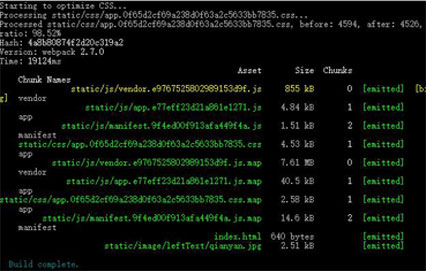
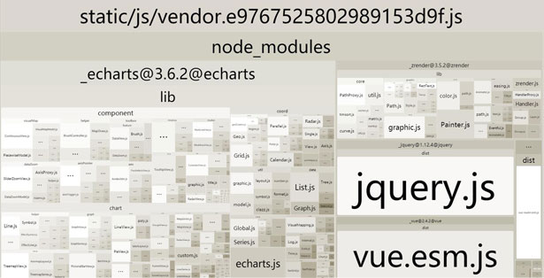
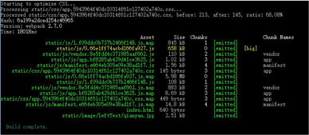
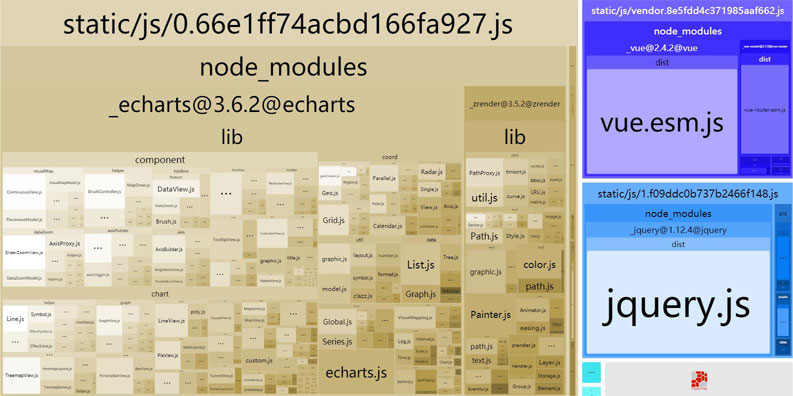
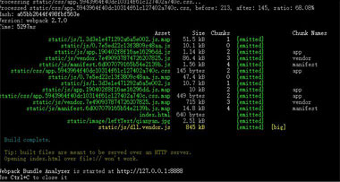
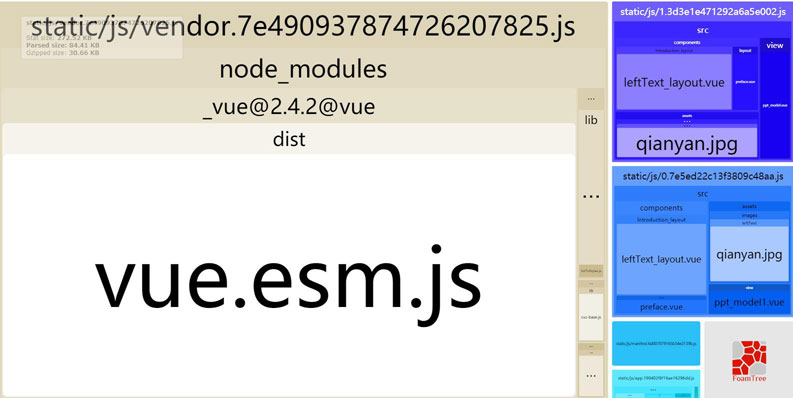

## 简述
我用了官方脚手架vue-cli，有两个页面<font color="#ff502c">ppt_model.vue</font>和 <font color="#ff502c">ppt_model1.vue</font>,在两个页面中分别引入了echarts、jquery
他<font color="#ff502c">默认</font>会把所有的报都打包到 <font color="#ff502c">app.js</font>和<font color="#ff502c">vendor.js</font>中。
运行<font color="#ff502c">npm run build --report</font>
如下图所示：
在cmd中显示打包信息

在页面中显示打包信息

## 懒加载
使用vue-router官方推荐的懒加载,基本语法是  <font color="#ff502c">component: resolve => require(['../view/ppt_model.vue'], resolve)</font>
会把每一个页面分开打包成一个js文件，当打包构建应用时，Javascript 包会变得非常大，影响页面加载。如果我们能把不同路由对应的组件分割成不同的代码块，然后当路由被访问的时候才加载对应组件，这样就更加高效了。
参考 > https://router.vuejs.org/zh-cn/advanced/lazy-loading.html
打包如下所示：
在cmd中显示打包信息

在页面中显示打包信息

其中的<font color="#ff502c">static/js/0.66e1ff74acbd166fa927.js</font>对应的是<font color="#ff502c">ppt_model.vue</font>页面
<font color="#ff502c">static/js/1.f09ddc0b737b2466f148.js</font>对应的是<font color="#ff502c">ppt_model1.vue</font>页面
## webpack官方提供的DllReferencePlugin
这个插件是在 webpack 主配置文件中设置的， 这个插件把只有 dll 的 bundle(们)(dll-only-bundle(s)) 引用到需要的预编译的依赖。
简单的说，就是把静态的插件库打包到一个静态文件里，同时生成对静态文件引用的json文件，通过webpack的DllReferencePlugin插件实现，打包的优化.
首先创建一个名为<font color="#ff502c">webpack.dll.config.js</font>文件，内容为：
```javascript
    var path = require('path');
    var webpack = require('webpack');

    module.exports = {
        entry: {
            vendor: ['vue-router', 'echarts', 'jquery', 'vue']
        },
        output: {
            path: path.join(__dirname, '../static/js'),
            filename: 'dll.[name].js',
            library: '[name]'
        },
        plugins: [
            new webpack.DllPlugin({
                path: path.join(__dirname, 'dll', '[name]-manifest.json'),
                name: '[name]',
                context: path.resolve(__dirname, 'client')
            }),
            new webpack.optimize.UglifyJsPlugin({
            compress: {
                warnings: false
            }
            })
        ]
    };
```
在你的项目文件夹目录cmd中运行<font color="#ff502c">webpack --config ./build/webpack.dll.config.js</font>在<font color="#ff502c">build</font>中新建了一个<font color="#ff502c">dll</font>中有一个<font color="#ff502c">vendor-manifest.json</font>和，在<font color="#ff502c">static(最外层的static)</font>中新建一个<font color="#ff502c">dll.vendor.js</font>。
在<font color="#ff502c">build</font>文件中<font color="#ff502c">webpack.prod.conf.js</font>添加一段代码
在打包前记得在index.html最下方，因为打包生成的js,<font color="#ff502c"><script src="./static/js/dll.vendor.js"></script></font>
```javascript
    // 记得在plugins中添加
    new webpack.DllReferencePlugin({
        context: path.join(__dirname, "client"),
        manifest: require("./dll/vendor-manifest.json")
    }),
```
再运行<font color="#ff502c">npm run build --report</font>
运行结果如图所示：
在cmd中显示打包信息

在页面中显示打包信息


<font color="#ff502c">__注意__</font>
在打包前记得在index.html最下方，引入打包生成的js
```html
    <!DOCTYPE html>
<html>
  <head>
    <meta charset="UTF-8">
    <meta name="viewport" content="width=device-width, initial-scale=1.0">
    <meta http-equiv="X-UA-Compatible" content="ie=edge">
    <title>dq2.0</title>
  </head>
  <body>
    <div id="app"></div>
    <!-- built files will be auto injected -->
    <script src="./static/js/dll.vendor.js"></script>
  </body>
</html>
```
如果报错，请参考 > https://router.vuejs.org/zh-cn/advanced/lazy-loading.html
本地可以预览页面效果，接口是不能调用的，dist中的index.html