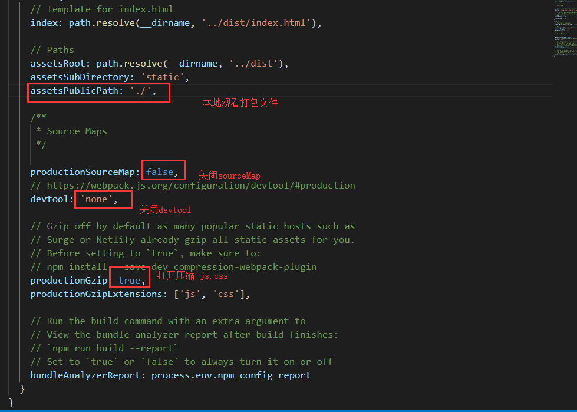

# vue-cli 配置
[项目源码](https://github.com/Braveheartforyou/vue-cli-jenkins)
[nginx配置gzip传输]()
## source-map、devtool、gzip
vue-cli 已经配置了一部分优化的，如关闭 <font color="#ff502c">source-map</font>、<font color="#ff502c">devtool</font>,<font color="#ff502c">开启gzip</font> 打包压缩，虽然打包时间变长但是，在配置好服务器的话，用户访问时间会很快 <font color="#ff502c">config/index.js</font> 如下

```javascript
    build: {
    // Template for index.html
    index: path.resolve(__dirname, '../dist/index.html'),

    // Paths
    assetsRoot: path.resolve(__dirname, '../dist'),
    assetsSubDirectory: 'static',
    assetsPublicPath: './',

    /**
     * Source Maps
     */

    productionSourceMap: false,
    // https://webpack.js.org/configuration/devtool/#production
    devtool: 'none',

    // Gzip off by default as many popular static hosts such as
    // Surge or Netlify already gzip all static assets for you.
    // Before setting to `true`, make sure to:
    // npm install --save-dev compression-webpack-plugin
    productionGzip: true,
    productionGzipExtensions: ['js', 'css'],

    // Run the build command with an extra argument to
    // View the bundle analyzer report after build finishes:
    // `npm run build --report`
    // Set to `true` or `false` to always turn it on or off
    bundleAnalyzerReport: process.env.npm_config_report
  }
```
## [抽取公用包](http://asyncnode.com/blog/vue-build-dll.html)
## [懒加载 按模块打包](http://asyncnode.com/blog/vue-build-dll.html)
## service-worker (这个必须要在https下才支持)
```bash
# 安装 sw-precache-webpack-plugin
yarn add sw-precache-webpack-plugin --save
```
在<font color="#ff502c">webpack.prod.conf.js</font>
```javascript
const SWPrecacheWebpackPlugin = require('sw-precache-webpack-plugin')
//在 plugins 数组中写入
// Generate a service worker script that will precache, and keep up to date,
// the HTML & assets that are part of the Webpack build.
new SWPrecacheWebpackPlugin({
    // By default, a cache-busting query parameter is appended to requests
    // used to populate the caches, to ensure the responses are fresh.
    // If a URL is already hashed by Webpack, then there is no concern
    // about it being stale, and the cache-busting can be skipped.
    dontCacheBustUrlsMatching: /\.\w{8}\./,
    filename: 'service-worker.js',
    logger(message) {
    if (message.indexOf('Total precache size is') === 0) {
        // This message occurs for every build and is a bit too noisy.
        return;
    }
    if (message.indexOf('Skipping static resource') === 0) {
        // This message obscures real errors so we ignore it.
        // https://github.com/facebookincubator/create-react-app/issues/2612
        return;
    }
    console.log(message);
    },
    minify: true,
    // For unknown URLs, fallback to the index page
    navigateFallback: './' + '/index.html',
    // Ignores URLs starting from /__ (useful for Firebase):
    // https://github.com/facebookincubator/create-react-app/issues/2237#issuecomment-302693219
    navigateFallbackWhitelist: [/^(?!\/__).*/],
    // Don't precache sourcemaps (they're large) and build asset manifest:
    staticFileGlobsIgnorePatterns: [/\.map$/, /asset-manifest\.json$/],
})
```
在<font color="#ff502c">src文件夹</font>中新建一个文件叫做<font color="#ff502c">registerServiceWorker.js</font>的文件写入
```javascript
// In production, we register a service worker to serve assets from local cache.

// This lets the app load faster on subsequent visits in production, and gives
// it offline capabilities. However, it also means that developers (and users)
// will only see deployed updates on the "N+1" visit to a page, since previously
// cached resources are updated in the background.

// To learn more about the benefits of this model, read https://goo.gl/KwvDNy.
// This link also includes instructions on opting out of this behavior.

const isLocalhost = Boolean(
  window.location.hostname === 'localhost' ||
    // [::1] is the IPv6 localhost address.
    window.location.hostname === '[::1]' ||
    // 127.0.0.1/8 is considered localhost for IPv4.
    window.location.hostname.match(
      /^127(?:\.(?:25[0-5]|2[0-4][0-9]|[01]?[0-9][0-9]?)){3}$/
    )
);
export default function register() {
  if (process.env.NODE_ENV === 'production' && 'serviceWorker' in navigator) {
    // The URL constructor is available in all browsers that support SW.
    const publicUrl = new URL('./', window.location);
    if (publicUrl.origin !== window.location.origin) {
      // Our service worker won't work if PUBLIC_URL is on a different origin
      // from what our page is served on. This might happen if a CDN is used to
      // serve assets; see https://github.com/facebookincubator/create-react-app/issues/2374
      return;
    }

    window.addEventListener('load', () => {
      const swUrl = `${'./'}service-worker.js`;

      if (isLocalhost) {
        // This is running on localhost. Lets check if a service worker still exists or not.
        checkValidServiceWorker(swUrl);

        // Add some additional logging to localhost, pointing developers to the
        // service worker/PWA documentation.
        navigator.serviceWorker.ready.then(() => {
          console.log(
            'This web app is being served cache-first by a service ' +
              'worker. To learn more, visit https://goo.gl/SC7cgQ'
          );
        });
      } else {
        // Is not local host. Just register service worker
        registerValidSW(swUrl);
      }
    });
  }
}

function registerValidSW(swUrl) {
  navigator.serviceWorker
    .register(swUrl)
    .then(registration => {
      registration.onupdatefound = () => {
        const installingWorker = registration.installing;
        installingWorker.onstatechange = () => {
          if (installingWorker.state === 'installed') {
            if (navigator.serviceWorker.controller) {
              // At this point, the old content will have been purged and
              // the fresh content will have been added to the cache.
              // It's the perfect time to display a "New content is
              // available; please refresh." message in your web app.
              console.log('New content is available; please refresh.');
            } else {
              // At this point, everything has been precached.
              // It's the perfect time to display a
              // "Content is cached for offline use." message.
              console.log('Content is cached for offline use.');
            }
          }
        };
      };
    })
    .catch(error => {
      console.error('Error during service worker registration:', error);
    });
}

function checkValidServiceWorker(swUrl) {
  // Check if the service worker can be found. If it can't reload the page.
  fetch(swUrl)
    .then(response => {
      // Ensure service worker exists, and that we really are getting a JS file.
      if (
        response.status === 404 ||
        response.headers.get('content-type').indexOf('javascript') === -1
      ) {
        // No service worker found. Probably a different app. Reload the page.
        navigator.serviceWorker.ready.then(registration => {
          registration.unregister().then(() => {
            window.location.reload();
          });
        });
      } else {
        // Service worker found. Proceed as normal.
        registerValidSW(swUrl);
      }
    })
    .catch(() => {
      console.log(
        'No internet connection found. App is running in offline mode.'
      );
    });
}

export function unregister() {
  if ('serviceWorker' in navigator) {
    navigator.serviceWorker.ready.then(registration => {
      registration.unregister();
    });
  }
}

```
