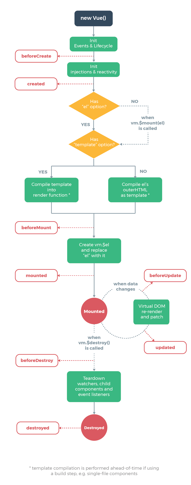
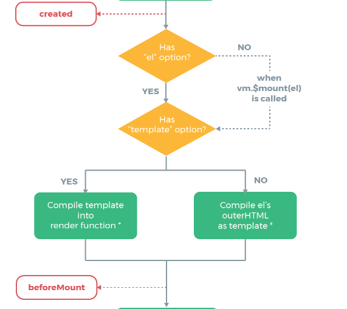

## Vue生命周期

---

[vue父子组件渲染生命周期执行循序](/blog/vue/vue-list-two.html)

### Vue声明周期表格

一说到Vue的生命周期，大家都能说上来一点.我自己会随着自己对Vue的深入了解，不断的完善自己对Vue的整体认识。
本文Vue的版本 <font color="#ff502c">Vue 2.x</font> 官方生命周期图解：
<!--  -->


|      生命周期钩子   |      详细     |
|:-----------------:|:----------------:|
| beforeCreate | 在实例初始化之后，数据观测(data observer) 和 event/watcher事件配置之前被调用。 |
| created | 在实例创建完成后被立即调用。在这一步,实例已经完成以下配置：数据观测（data observer），属性和方法的运算，watch/event事件回调。然而，挂载阶段还没有开始，<font color="#ff502c">$el</font>属性目前不可见。 |
| beforeMount | 在挂载开始之前被调用：相关的 <font color="#ff502c">render</font> 函数首次被调用。**该钩子在服务器端渲染期间不被调用。** |
| mounted | <font color="#ff502c">el</font>被新创建的<font color="#ff502c">vm.$el</font>替换，并挂载到实例上去之后调用该钩子。如果root实例挂载了一个文档内元素，当 mounted 被调用时 vm.$el 也在文档内。 <br/> 注意 mounted **不会** 承诺所有的子组件也一起被挂载。如果你希望等到整个视图都渲染完毕，可以用 vm.$nextTick 替换掉 mounted。 **该钩子在服务器端渲染期间不被调用。** |
| beforeUpdate | 数据更新时调用，发生在虚拟DOM打补丁之前。这里适合在更新之前访问现在的DOM，比如手动移除已添加的事件监听器。**该钩子在服务器渲染期间不被调用，因为只有初次渲染会在服务器端运行** |
| updated | 由于数据更改导致的虚拟dom重新渲染和打补丁，在这之后会调用该钩子。<br/> 当这个钩子被调用时，组件DOM已经更新，所以你现在可以执行依赖于DOM的操作。然后在大多数情况下，你应该避免在此期间更改状态。如果要相应的状态改变，通常最好使用 [<font color="#ff502c">计算属性</font>](https://cn.vuejs.org/v2/api/#computed)或[<font color="#ff502c">watcher</font>](https://cn.vuejs.org/v2/api/#watch)取而代之。 <br/> 注意 <font color="#ff502c">updated</font> 不会承诺所有的子组件也都一起被重绘。如果你希望等到整个视图都重绘完毕，可以用 vm.$nextTick 替换掉 <font color="#ff502c">updated</font>。 |
| beforeDestory | 实例销毁之前调用。在这一步，实例仍然完全可用。 **该钩子在服务器端渲染期间不被调用。** |
| destoryed | Vue 实例销毁后调用。调用后，Vue 实例指示的所有东西都会解绑定，所有的事件监听器会被移除，所有的子实例也会被销毁。 **该钩子在服务器端渲染期间不被调用。** |

### 示例代码

```html
<!DOCTYPE html>
<html lang="en">
<head>
  <meta charset="UTF-8">
  <meta name="viewport" content="width=device-width, initial-scale=1.0">
  <meta http-equiv="X-UA-Compatible" content="ie=edge">
  <title>Document</title>
</head>
<body>
  <div id="app">
    <p @click="setMessage">{{message}}</p>
  </div>
  <script src="https://cdn.bootcss.com/vue/2.6.10/vue.js"></script>
  <script>
    var vm = new Vue({
      el: '#app',
      data: {
        message: 'Vue的生命周期'
      },
      methods: {
        setMessage: function () {
          this.message = 'updateMessage';
        }
      },
      beforeCreate() {
        console.group('------beforeCreate创建前状态------');
        console.log("%c%s", "color:red" , this.$el); // undefined
        console.log("%c%s", "color:red", this.$data); // undefined
        console.log("%c%s", "color:red", this.message); // undefined
      },
      created() {
        console.group('------created创建完毕状态------');
        console.log('%c%s', 'color:red', this.$el); // undefined
        console.log('%c%s', 'color:red', this.$data); // Object ** 已经初始化
        console.log('%c%s', 'color:red', this.message); // Vue的生命周期 ** 已经初始化
      },
      // 当不存在el的时候只会执行到前面两个生命周期
      beforeMount() {
        console.group('------beforeMount挂载前状态------');
        console.log("%c%s", "color:red" , this.$el); // 已经初始化
        console.log(this.$el);
        console.log("%c%s", "color:red", this.$data); // 已经初始化
        console.log("%c%s", "color:red", this.message); // 已经初始化
      },
      mounted() {
        console.group('------mounted挂载前状态------');
        console.log("%c%s", "color:red" , this.$el); // 已经初始化
        console.log(this.$el);
        console.log("%c%s", "color:red", this.$data); // 已经初始化
        console.log("%c%s", "color:red", this.message); // 已经初始化
      },
      beforeUpdate() {
        console.group('------beforeUpdate挂载前状态------');
        console.log("%c%s", "color:red" , this.$el);
        console.log(this.$el);
        console.log("%c%s", "color:red", this.$data);
        console.log("%c%s", "color:red", this.message);
      },
      updated() {
        console.group('------updated挂载前状态------');
        console.log("%c%s", "color:red" , this.$el);
        console.log(this.$el);
        console.log("%c%s", "color:red", this.$data);
        console.log("%c%s", "color:red", this.message);
      },
      beforeDestroy() {
        console.group('------beforeDestroy挂载前状态------');
        console.log("%c%s", "color:red" , this.$el);
        console.log(this.$el);
        console.log("%c%s", "color:red", this.$data);
        console.log("%c%s", "color:red", this.message);
      },
      destroyed() {
        console.group('------destroyed挂载前状态------');
        console.log("%c%s", "color:red" , this.$el);
        console.log(this.$el);
        console.log("%c%s", "color:red", this.$data);
        console.log("%c%s", "color:red", this.message);
      }
    })
  </script>
</body>
</html>
```

### 注意事项

**1、beforeMount生命周期之前**


在这个调用<font color="#ff502c">beforeMount</font>判断vm.$options是否存在<font color="#ff502c">el</font>，如果没有的话则会<font color="#ff502c">停止编译</font>，也就意味着<font color="#ff502c">停止了生命周期</font>，直到在改vue实例上调用<font color="#ff502c">vm.$mount(el)</font>。

vue的实现代码：如果存在`el`时

```javascript
if (vm.$options.el) {
  vm.$mount(vm.$options.el);
}
```

原型上的`$mount`实现

```javascript
Vue.prototype.$mount = function (
  el,
  hydrating
) {
  el = el && inBrowser ? query(el) : undefined;
  return mountComponent(this, el, hydrating)
};
function mountComponent (
  vm,
  el,
  hydrating
) {
  vm.$el = el;
  if (!vm.$options.render) {
    vm.$options.render = createEmptyVNode;
  }
  callHook(vm, 'beforeMount');
}
```

如果我们注释掉上面`el`属性的代码,并且不再后续调用`vm.$mount(el)`

```javascript
  // el: '#app'
```

如果没有`el`他只会执行前两个生命周期<font color="#ff502c">beforeCreate、created</font>，如果我们在后续调用了<font color="#ff502c">vm.$mount(el)</font>，可以发现代码继续向下执行了

在浏览器上调用：

```javascript
  vm.$mount('#app');
```

他就会接着执行下去

**2、template属性、outer html、render函数三个优先级**

1. 如果直接调用`render`函数，那么他的优先级最高。
2. 如果`vue`实例对象中有`template`参数选项，则将其作为模板编译成`render`函数。
3. 如果没有`template`选项，则将外部`HTML`作为模板编译。
4. 可以看到`template`中的模板优先级要高于`outer HTML`的优先级。

```html
  <!DOCTYPE html>
<html lang="en">
<head>
  <meta charset="UTF-8">
  <meta name="viewport" content="width=device-width, initial-scale=1.0">
  <meta http-equiv="X-UA-Compatible" content="ie=edge">
  <title>Document</title>
</head>
<body>
  <div id="app">
    // 如果render、template都不存在 会显示这个
    <p>{{message + '这是在outer HTML中的'}}</p> 
    // 如果三个都存在 最终会显示 <h1>this is createElement</h1>
  </div>
  <script src="https://cdn.bootcss.com/vue/2.6.10/vue.js"></script>
  <script>
    var vm = new Vue({
      el: '#app',
      template: "<h1>{{message +'这是在template中的'}}</h1>", // 如果render不存在 只有 template 会显示这个
      data: {
        message: 'Vue的生命周期'
      },
      render: function (createElement) {
        return createElement('h1', 'this is createElement')
      }
    })
  </script>
</body>
</html>
```

**3、mounted**
可以看到此时是给`vue`实例对象添加`$el`成员，并且替换掉挂在的`DOM`元素。因为在之前`console`中打印的结果可以看到`beforeMount`之前`el`上还是`undefined`

**4、mounted**
在`mounted`之前`h1`中还是通过`{{message}}`进行占位的，因为此时还有挂在到页面上，还是`JavaScript`中的虚拟`DOM`形式存在的。在`mounted`之后可以看到`h1`中的内容发生了变化。

**5、beforeUpdate和updated**
当`vue`发现`data`中的数据发生了改变，会触发对应组件的重新渲染，先后调用`beforeUpdate`和`updated`钩子函数。我们点击当前的`p`标签就会触发`data`中的`message`更新

**6、beforeDestroy和destroyed**
`beforeDestroy` 钩子函数在实例销毁之前调用。在这一步，实例仍然完全可用。
`destroyed` 钩子函数在`Vue` 实例销毁后调用。调用后，`Vue` 实例指示的所有东西都会解绑定，所有的事件监听器会被移除，所有的子实例也会被销毁。

## 参考

[详解vue生命周期](https://segmentfault.com/a/1190000011381906?utm_source=tag-newest)
[详解 Vue 生命周期实现](https://juejin.im/post/5c6d48e36fb9a049eb3c84ff)
