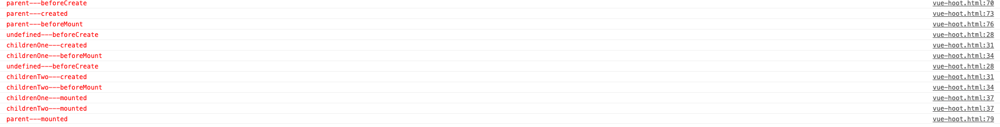

## vue 生命周期

---

在另一片博客中我已经有详细讲过[vue 生命周期](/blog/vue/vue-list-one.html)

## 代码

```html
<!DOCTYPE html>
<html lang="en">

<head>
    <meta charset="UTF-8">
    <meta name="viewport" content="width=device-width, initial-scale=1.0">
    <meta http-equiv="X-UA-Compatible" content="ie=edge">
    <title>Document</title>
</head>

<body>
    <div id="app">
        <p @click="setParentMessage">{{message}}</p>
        <child :msg="parentMsgOne"></child>
        <child :msg="parentMsgTwo"></child>
    </div>
    <script src="https://cdn.bootcss.com/vue/2.6.10/vue.min.js"></script>
    <script>
        var mixins = {
            props: ['msg'],
            template: '<div>from child: {{childMsg}} </div>',
            data: function () {
                return {
                    childMsg: this.msg
                }
            },
            beforeCreate() {
                console.log("%c%s", "color:red", this.childMsg + '---beforeCreate');
            },
            created() {
                console.log("%c%s", "color:red", this.childMsg + '---created');
            },
            beforeMount() {
                console.log("%c%s", "color:red", this.childMsg + '---beforeMount');
            },
            mounted() {
                console.log("%c%s", "color:red", this.childMsg + '---mounted');
            },
            beforeUpdate() {
                console.log("%c%s", "color:red", this.childMsg + '---beforeUpdate');
            },
            updated() {
                console.log("%c%s", "color:red", this.childMsg + '---updated');
            },
            beforeDestroy() {
                console.log("%c%s", "color:red", this.childMsg + '---beforeDestroy');
            },
            destroyed() {
                console.log("%c%s", "color:red", this.childMsg + '---destroyed');
            }
        };
        Vue.component('child', {
            mixins: [mixins]
        });
        var vm = new Vue({
            el: '#app',
            data: function () {
                return {
                    parentMsgOne: 'childrenOne',
                    parentMsgTwo: 'childrenTwo',
                    message: 'parent'
                }
            },
            methods: {
                setParentMessage: function () {
                    this.message = 'parent--message--更新';
                }
            },
            beforeCreate() {
                console.log("%c%s", "color:red", 'parent---beforeCreate');
            },
            created() {
                console.log("%c%s", "color:red", 'parent---created');
            },
            beforeMount() {
                console.log("%c%s", "color:red", 'parent---beforeMount');
            },
            mounted() {
                console.log("%c%s", "color:red", 'parent---mounted');
            },
            beforeUpdate() {
                console.log("%c%s", "color:red", 'parent---beforeUpdate');
            },
            updated() {
                console.log("%c%s", "color:red", 'parent---updated');
            },
            beforeDestroy() {
                console.log("%c%s", "color:red", 'parent---beforeDestroy');
            },
            destroyed() {
                console.log("%c%s", "color:red", 'parent---destroyed');
            }
        });
    </script>
</body>

</html>
```

代码执行结果如下：



### ** beforeCreate 到 mounted **

1. 先创建父组件
`beforeCreate`
`created`
`beforeMount`
2. 按顺序创建子组件
`beforeCreate`
`created`
`beforeMount`
3. 先挂载子组件
`mounted`
4. 在挂载父组件
`mounted`

总结：<font color="#ff502c">从创建到挂载，是从外到内，再由内到外</font>

### ** beforeUpdate 到 updated **

> 注： <font color="#ff502c">只有在标签上绑定了 data 时，data 发生改变，才会触发 updated 钩子函数。如果只是在控制台改变 data，而没有反馈到视图上，则无法触发。</font>

1. 父组件点击事件更新 `data` 中的数据

他不会重新渲染子组件

> 注：<font color="#ff502c">react 中如果父组件状态更新，子组件也会跟着更新。稍后的文章会讲怎么解决这种问题。</font>

2. 子组件点击事件更新 `data` 中的数据


这个他也不会重新选然父组件

> 注： <font color="#ff502c">如果是 mixins 的话当 data 中的数据改变时，不会触发子组件中的 updated 函数。触发的顺序仍然是 mixins 先于组件</font>

> 总结：<font color="#ff502c">父子组件 update 互相不影响</font>

### ** beforeDestroy 到 destroy **

在浏览器中执行：

```javascript
vm.$destroy();
```


1. 父组件先`beforeDestroy`
2. 子组件`beforeDestroy`
3. 子组件`destroyed`
4. 父组件`destroyed`

## 总结

整体来说**vue父子组件**生命周期执行顺序为<font color="#ff502c">从外到内，再从内到外</font>,
<font color="#ff502c">**总结：生命周期遵从“从外到内，再从内到外，mixins先于组件”的原则。**</font>
