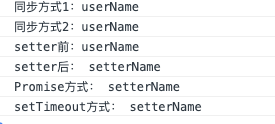

## 简介

在 vue 的官方文档中有一个 API 叫做 nextTick，将回调延迟到下次 DOM 更新循环之后执行。在修改数据之后立即使用这个方法，获取更新后的 DOM。
**语法**

```javascript
vm.$nextTick([callback]);
```

- 参数：

```javascript
{
  Function;
}
[callback];
```

**用法**
放在`Vue.nextTick()`回调函数中的执行的应该是**涉及 DOM**操作的 JavaScript 代码。

Vue 的响应式原理：在 data 选项里所有属性都会被`watcher`监控，当修改了`data`的某一个值，并不会**立即**反映到视图中。Vue 会将我们对`data`的更改放到`watcher`的一个队列中（异步），只有在当前任务空闲时才会去执行`watcher`队列任务。这就有一个延迟时间，所以对 dom 的操作要放在`$nextTick`中来操作，才能获取到最新的`dom`。

> [响应式对象 Observer](/blog/vue/vue-definedProperty.html) > [依赖收集 Dep](/blog/vue/vue-dep.html) > [派发更新 Watcher](/blog/vue/vue-notify.html)

`nextTick` 是 Vue 的一个**核心**实现，如果还不了解 js 运行机制，可以看一下另一篇文章[js 运行机制](/blog/javascript/evenloop.html)，这里就不多赘述了。

在浏览器环境中常见的 macro task 和 micro task 如下：
**macro task**：

- `setTimeout、setTimeInterval`
- `MessageChannel`
- `postMessage`
- `setImmediate`
- `requestAnimationFrame`
- `I/O`
- `UI 渲染`a

**micro task**：

- MutationObsever
- Promise.then
- process.nextTick

## vue 源码解析

在[派发更新 Watcher](/blog/vue/vue-notify.html)里面有用到`nextTick(flushScheduerQueue)`，其实就是`vue`对派发更新的一个优化。下面直接看源码，在 src/core/util/next-tick.js 中：

```javascript
// nextTick 中执行回调函数的原因是保证在同一个 tick 内多次执行 nextTick，不会开启多个异步任务，而把这些异步任务都压成一个同步任务，在下一个 tick 执行完毕。
import { noop } from "shared/util";
import { handleError } from "./error";
import { isIOS, isNative } from "./env";
// flushScheduerQueue
/*存放异步执行的回调*/
const callbacks = [];
//一个标记位，如果已经有timerFunc被推送到任务队列中去则不需要重复推送
let pending = false;
/*下一个tick时的回调*/
function flushCallbacks() {
  pending = false;
  //复制callback
  const copies = callbacks.slice(0);
  //清除callbacks
  callbacks.length = 0;
  for (let i = 0; i < copies.length; i++) {
    //触发callback的回调函数
    copies[i]();
  }
}

// Here we have async deferring wrappers using both microtasks and (macro) tasks.
// In < 2.4 we used microtasks everywhere, but there are some scenarios where
// microtasks have too high a priority and fire in between supposedly
// sequential events (e.g. #4521, #6690) or even between bubbling of the same
// event (#6566). However, using (macro) tasks everywhere also has subtle problems
// when state is changed right before repaint (e.g. #6813, out-in transitions).
// Here we use microtask by default, but expose a way to force (macro) task when
// needed (e.g. in event handlers attached by v-on).
/**
  其大概的意思就是：在Vue2.4之前的版本中，nextTick几乎都是基于microTask实现的，
  但是由于microTask的执行优先级非常高，在某些场景之下它甚至要比事件冒泡还要快，
  就会导致一些诡异的问题；但是如果全部都改成macroTask，对一些有重绘和动画的场
  景也会有性能的影响。所以最终nextTick采取的策略是默认走microTask，对于一些DOM
  的交互事件，如v-on绑定的事件回调处理函数的处理，会强制走macroTask。
  **/
let microTimerFunc;
let macroTimerFunc;
let useMacroTask = false;

// Determine (macro) task defer implementation.
// Technically setImmediate should be the ideal choice, but it's only available
// in IE. The only polyfill that consistently queues the callback after all DOM
// events triggered in the same loop is by using MessageChannel.
/* istanbul ignore if */

// 而对于macroTask的执行，Vue优先检测是否支持原生setImmediate（高版本IE和Edge支持），
// 不支持的话再去检测是否支持原生MessageChannel，如果还不支持的话为setTimeout(fn, 0)。
if (typeof setImmediate !== "undefined" && isNative(setImmediate)) {
  macroTimerFunc = () => {
    setImmediate(flushCallbacks);
  };
} else if (
  typeof MessageChannel !== "undefined" &&
  /**
    在Vue 2.4版本以前使用的MutationObserver来模拟异步任务。
    而Vue 2.5版本以后，由于兼容性弃用了MutationObserver。
    Vue 2.5+版本使用了MessageChannel来模拟macroTask。
    除了IE以外，messageChannel的兼容性还是比较可观的。
    **/
  (isNative(MessageChannel) ||
    // PhantomJS
    MessageChannel.toString() === "[object MessageChannelConstructor]")
) {
  /**
    可见，新建一个MessageChannel对象，该对象通过port1来检测信息，port2发送信息。
    通过port2的主动postMessage来触发port1的onmessage事件，
    进而把回调函数flushCallbacks作为macroTask参与事件循环。
    **/
  const channel = new MessageChannel();
  const port = channel.port2;
  channel.port1.onmessage = flushCallbacks;
  macroTimerFunc = () => {
    port.postMessage(1);
  };
} else {
  /* istanbul ignore next */
  macroTimerFunc = () => {
    setTimeout(flushCallbacks, 0);
  };
}

// Determine microtask defer implementation.
/* istanbul ignore next, $flow-disable-line */
if (typeof Promise !== "undefined" && isNative(Promise)) {
  const p = Promise.resolve();
  microTimerFunc = () => {
    p.then(flushCallbacks);
    // in problematic UIWebViews, Promise.then doesn't completely break, but
    // it can get stuck in a weird state where callbacks are pushed into the
    // microtask queue but the queue isn't being flushed, until the browser
    // needs to do some other work, e.g. handle a timer. Therefore we can
    // "force" the microtask queue to be flushed by adding an empty timer.
    if (isIOS) setTimeout(noop);
  };
} else {
  // fallback to macro
  microTimerFunc = macroTimerFunc;
}

/**
 * Wrap a function so that if any code inside triggers state change,
 * the changes are queued using a (macro) task instead of a microtask.
 */
/*
    推送到队列中下一个tick时执行
    cb 回调函数
    ctx 上下文
  */
export function withMacroTask(fn: Function): Function {
  return (
    fn._withTask ||
    (fn._withTask = function() {
      useMacroTask = true;
      const res = fn.apply(null, arguments);
      useMacroTask = false;
      return res;
    })
  );
}
export function nextTick(cb?: Function, ctx?: Object) {
  let _resolve;
  callbacks.push(() => {
    if (cb) {
      try {
        cb.call(ctx);
      } catch (e) {
        handleError(e, ctx, "nextTick");
      }
    } else if (_resolve) {
      _resolve(ctx);
    }
  });
  if (!pending) {
    pending = true;
    if (useMacroTask) {
      macroTimerFunc();
    } else {
      microTimerFunc();
    }
  }
  // $flow-disable-line
  if (!cb && typeof Promise !== "undefined") {
    return new Promise(resolve => {
      _resolve = resolve;
    });
  }
}
```

`nextTick`这就是我们在上一节执行 `nextTick(flushSchedulerQueue)` 所用到的函数。它的逻辑也很简单，把传入的回调函数 `cb` 压入 `callbacks` 数组，最后一次性地根据 `useMacroTask` 条件执行 `macroTimerFunc` 或者是 `microTimerFunc`，而它们都会在下一个 `tick` 执行 `flushCallbacks`。
`flushCallbacks` 这个方法就是挨个**同步**的去执行`callbacks`中的回调函数，`callbacks`中的回调函数是在调用 `nextTick` 的时候添加进去的；
这里使用 `callbacks` 而不是直接在 `nextTick` 中执行回调函数的原因是保证在同一个 `tick` 内多次执行 `nextTick`，不会开启多个异步任务，而把这些异步任务都压成一个同步任务，在下一个 `tick` 执行完毕。
注意这里有个比较难理解的地方，第一次调用 `nextTick` 的时候 `pending` 为`false`。
此时已经`push`到浏览器`event loop`中一个**宏任务**或**微任务**的`task`，如果在没有`flush`掉的情况下继续往`callbacks`里面添加。
那么在执行这个占位`queue`的时候会执行之后添加的回调，所以`macroTimerFunc`、`microTimerFunc` 相当于`task queue`的占位。
以后 `pending` 为`true`则继续往占位`queue`里面添加，`event loop`轮到这个`task queue`的时候将一并执行。
执行 `flushCallbacks` 时 `pending` 置`false`，允许下一轮执行 `nextTick` 时往`event loop`占位。

**macroTimerFunc、microTimerFunc**
`next-tick.js` 申明了 `microTimerFunc` 和 `macroTimerFunc` 2 个变量，它们分别对应的是 `micro task` 的函数和 `macro task` 的函数。对于 `macro task` 的实现，优先检测是否支持原生 `setImmediate`，这是一个高版本 `IE` 和 `Edge`才支持的特性，不支持的话再去检测是否支持原生的 `MessageChannel`，如果也不支持的话就会降级为 `setTimeout` 0；而对于 `micro task` 的实现，则检测浏览器是否原生支持 `Promise，`不支持的话直接指向 `macro task` 的实现。

**nextTick 实现**

1. 首先 `nextTick` 把传入的 `cb` 回调函数用 `try-catch` 包裹后放在一个**匿名函数**中推入`callbacks`数组中。
   这么做是因为防止单个 `cb` 如果执行错误不至于让整个**JS 线程挂掉**。
   每个 cb 都包裹是防止这些回调函数如果执行错误不会相互影响，比如前一个抛错了后一个仍然可以执行。
2. 然后检查 `pending` 状态，这个跟之前介绍的 `queueWatcher` 中的 `waiting` 是一个意思。
   它是一个标记位，一开始是 `false` 在进入`macroTimerFunc`、`microTimerFunc`方法前被置为 `true`。因此下次调用 `nextTick` 就不会进入`macroTimerFunc`、`microTimerFunc`方法。
   这两个方法中会在下一个 `macro/micro tick` 时候 `flushCallbacks` 异步的去执行`callbacks队`列中收集的任务，而 `flushCallbacks` 方法在执行一开始会把 `pending` 置 `false`。
   因此下一次调用 `nextTick` 时候又能开启新一轮的 `macroTimerFunc`、`microTimerFunc`，这样就形成了 vue 中的 `event loop`。
3. 最后检查是否传入了 `cb`。因为 `nextTick` 还支持 Promise 化的调用：`nextTick().then(() => {})`。所以如果没有传入 `cb` 就直接`return了一个Promise`实例，并且把`resolve`传递给`_resolve`。这样后者执行的时候就跳到我们调用的时候传递进 then 的方法中。

## 示例

代码如下：

```javascript
<template>
  <div id="app">
    <span id='name' ref='name'>{{ name }}</span>
    <button @click='change'>change name</button>
    <div id='content'></div>
  </div>
</template>
<script>
  export default {
    data() {
      return {
        name: 'userName'
      }
    },
    methods: {
      change() {
        const $name = this.$refs.name
        console.log('同步方式1：' + this.$refs.name.innerHTML)
        this.$nextTick(() => console.log('setter前：' + $name.innerHTML))
        this.name = ' setterName '
        console.log('同步方式2：' + this.$refs.name.innerHTML)
        // setTimeout(() => {console("setTimeout方式：" + this.$refs.name.innerHTML)}
        setTimeout(() => {
          console.log('setTimeout方式：' + this.$refs.name.innerHTML);
        });
        this.$nextTick(() => console.log('setter后：' + $name.innerHTML))
        this.$nextTick().then(() => console.log('Promise方式：' + $name.innerHTML))
      }
    }
  }
</script>
```

执行结果如下图所示：


1. 同步方式： 当把`data`中的`name`修改之后，此时会触发`name`的 `setter` 中的 `dep.notify` 通知依赖本`data`的`render watcher`去 `update`，`update` 会把 `flushSchedulerQueue` 函数传递给 `nextTick`，`render watcher`在 `flushSchedulerQueue` 函数运行时 `watcher.run` 再走 `diff -> patch` 那一套重渲染 `re-render` 视图，这个过程中会重新依赖收集，这个过程是异步的；所以当我们直接修改了`name`之后打印，这时异步的改动还没有被 `patch` 到视图上，所以获取视图上的 DOM 元素还是原来的内容。
2. setter 前： `setter`前为什么还打印原来的是原来内容呢，是因为 `nextTick` 在被调用的时候把回调挨个`push`进`callbacks`数组，之后执行的时候也是 for 循环出来挨个执行，所以是类似于队列这样一个概念，先入先出；在修改`name`之后，触发把`render watcher`填入 `schedulerQueue` 队列并把他的执行函数 `flushSchedulerQueue` 传递给 `nextTick` ，此时`callbacks`队列中已经有了 `setter`前函数 了，因为这个 `cb` 是在 `setter`前函数 之后被`push`进`callbacks`队列的，那么先入先出的执行`callbacks`中回调的时候先执行 `setter`前函数，这时并未执行`render watcher`的 `watcher.run`，所以打印 DOM 元素仍然是原来的内容。
3. setter 后： `setter`后这时已经执行完 `flushSchedulerQueue`，这时`render watcher`已经把改动 `patch` 到视图上，所以此时获取 DOM 是改过之后的内容。
4. Promise 方式： 相当于 `Promise.then` 的方式执行这个函数，此时 DOM 已经更改。
5. setTimeout 方式： 最后执行`macro task`的任务，此时 DOM 已经更改。

注意，在执行 `setter`前函数 这个异步任务之前，同步的代码已经执行完毕。异步的任务都还未执行，所有的 `$nextTick` 函数也执行完毕。所有回调都被`push`进了`callbacks`队列中等待执行，所以在`setter`前函数执行的时候。此时`callbacks`队列是这样的：

```javascript
[setter前函数, flushSchedulerQueue, setter后函数, Promise方式函数];
```

它是一个`micro task`队列，执行完毕之后执行`macro task` `setTimeout`，所以打印出上面的结果。

## 总结

- `nextTick`是把要执行的任务推入到一个队列中，在下一个`tick`同步执行
- 数据改变后触发渲染`watcher`的`update`，但是`watchers`的`flush`是在`nextTick`后，所以重新渲染是异步的

## 参考

> [nextTick](https://ustbhuangyi.github.io/vue-analysis/reactive/next-tick.html#js-%E8%BF%90%E8%A1%8C%E6%9C%BA%E5%88%B6)
> [深入理解 Vue 响应式原理](http://jungahuang.com/2018/02/07/About-responsive-of-Vue/)
> [Vue 源码阅读 - 批量异步更新与 nextTick 原理](https://juejin.im/post/5b50760f5188251ad06b61be)
