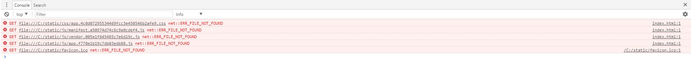

## 运行npm run build 本地查看页面效果
 ### 本文以vue官方脚手架vue-cli构建的项目为例
 这时如果直接运行npn run build是可以运行并打包你的代码的，不会报任何异常或错误，但是你会看到你的命令行打包完成有这样一句提示：
 ```javascript
  Build complete.
  Tip: built files are meant to be served over an HTTP server.
  Opening index.html over file:// won\'t work
 ```
 运行完npm run build,打开项目中的dist目录下的index.html文件！
 看到index.html的 <font color="#ff502c">控制台</font>会出现一片<font color="#ff502c">404</font> 如下图：
 
 ### 解决方案
  因为<font color="#ff502c"> config </font>目录下的<font color="#ff502c"> index.js </font>中的<font color="#ff502c"> build </font>配置的<font color="#ff502c"> assetsPublicPath </font>为<font color="#ff502c"> / </font>绝对路径,所以找不到打包以后的资源
  我们只要报<font color="#ff502c"> build </font>中的<font color="#ff502c"> assetsPublicPath </font>改为<font color="#ff502c"> ./ </font>就可以了，在运行一次npm run build,再打开index.html就可以在本地看了