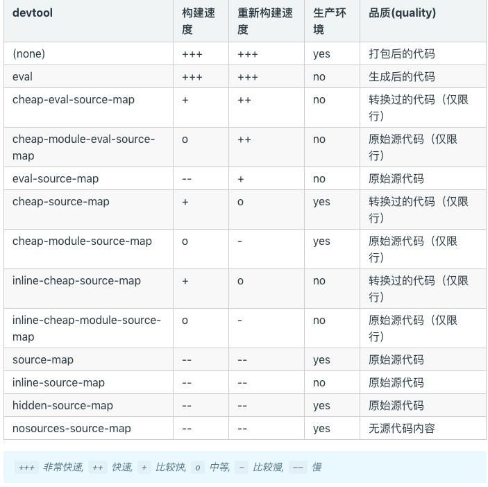
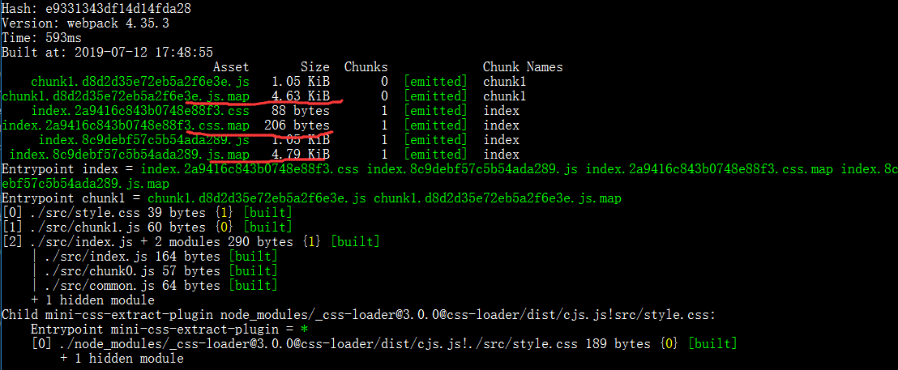

## 简介

在 webpack 中的比如在调试 vue 代码或者 react 代码中，调试打包后的代码时候，我们都会用到一个叫做 soruce-map，我们都是通过 devtool 来配置。比如说在 vue-cli 或者 create-react-app 中都有用到，source-map 有很多种，我们在这里记录一下他们对应的解释。
在编写 vue、react 的时候，我们想做懒加载是，有非常适合 chunk splitting 的模块，比如说 vue-router、react-router，在做懒加载切割的时候有三个要注意的不如说 WebpackChunkName、WebpackPreload、WebpackPrefetch 三个配置，他们分别对应 chunk 的 name，和 chunk 代码何时被加载。

> [chunkhas-hash-contenthash](/blog/webpack/docs/webpack-chunkhas-hash-contenthash.html)

## source-map

当 webpack 打包源代码时，可能会很难追踪到 error(错误) 和 warning(警告) 在源代码中的原始位置。source-map 就是帮忙**追踪 rror(错误) 和 warning(警告)的**。
通过下面官方提供的表格一览 devtool 对应 source-map 的配置和速度影响：

在这个上面那种适合 prod 那种适合 dev 环境，还有构建速度和重新构建速度等等。我们可以在上面的基础上再把所有的配置分为四类，**cheap、inline、eval、module**四种，再在这种基础上看一下他们的区别，当然官方提供了 devtool 各种配置下得具体区别，有兴趣的可以看一下[devtool 各种打包区别](https://github.com/webpack/webpack/tree/master/examples/source-map)。

**heap、inline、eval、module 四种解释如下图标所示**

| 带有参数 |                                                                                                          不同的表现                                                                                                          |
| :------: | :--------------------------------------------------------------------------------------------------------------------------------------------------------------------------------------------------------------------------: |
|  cheap   |                                                               带有 cheap 参数的表示，在追踪 error、warning 时，只显示当前文件的行数，不显示当前在行数中的列数                                                                |
|  inline  |                                                                        source map 转换为 DataUrl（base64） 后添加到 bundle 中，不产生 source-map 文件                                                                        |
|   eval   | 打包后的模块都使用 eval() 执行，行映射可能不准；不产生独立的 map 文件， 四中带有 eval 的对比请看[四中 eval 对比](https://webpack.docschina.org/configuration/devtool#%E5%AF%B9%E4%BA%8E%E5%BC%80%E5%8F%91%E7%8E%AF%E5%A2%83) |
|  module  |                                                                                              增加第三方库的 error、warning 追踪                                                                                              |

在下面对比 source-map、eval-source-map、cheap-source-map、cheap-module-source-map、inline-souce-map 来验证我们上面的总结
基础代码是在[另一篇博客](/blog/webpack/docs/webpack-chunkhas-hash-contenthash.html)中

### source-map

webpack 中用使用 devtool，修改 webpack.config.js 文件代码如下：

```javascript
const MiniCssExtractPlugin = require('mini-css-extract-plugin'); // 新增
module.exports = {
  mode: 'production',
  devtool: 'source-map',
  entry: {
    index: './src/index.js',
    chunk1: './src/chunk1.js'
  },
  output: {
    filename: '[name].[chunkhash].js'
  },
  module: {
    // 新增
    rules: [
      {
        test: /\.css$/,
        use: [MiniCssExtractPlugin.loader, 'css-loader']
      }
    ]
  },
  plugins: [
    // 新增
    // 提取css插件
    new MiniCssExtractPlugin({
      // Options similar to the same options in webpackOptions.output
      // both options are optional
      filename: '[name].[contenthash].css'
    })
  ]
};
```

运行 webpack 结果如下：

可以看到多了三个文件，就是对应我们业务代码 bundle 的 map 映射。

### eval-source-map

修改 devtool，修改 webpack.config.js 文件代码如下：

```javascript
```

### cheap-source-map

### cheap-module-source-map

### inline-souce-map

## WebpackPreload、WebpackPrefetch、WebpackChunkName

## 总结

**devtool**

- 在 dev 环境中推荐使用 cheap-module-eval-source-map
- 在生产环境不推荐使用 devtool 一般都是使用 false、‘none’，如果线上有错误日志收集的话推荐使用 source-map。

注意：如果生产环境上使用了 source-map，你应该将你的服务器配置为，不允许普通用户访问 source map 文件！
