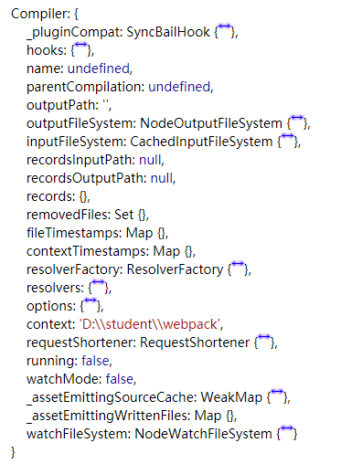
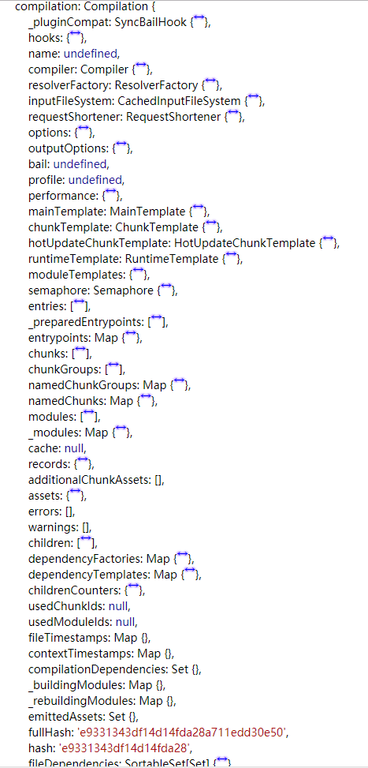

## 简介

插件是 webpack 的支柱功能。`webpack` 自身也是构建于，你在 `webpack` 配置中用到的相同的插件系统之上！插件目的在于解决 `loader` 无法实现的其他事。
要想写好插件就要知道`Webpack`中的两个比较核心的概念`compiler`、`compilation`、`tapable`。在[webpack 编译流程](/blog/webpack/webpack-process.html)已经都要记录。
`Webpack` 通过 `Plugin` 机制让其更加灵活，以适应各种应用场景。 在 `Webpack` 运行的生命周期中会广播出许多事件，`Plugin` 可以监听这些事件，在合适的时机通过 `Webpack` 提供的 `API` 改变输出结果。

## 实现一个 plugin

一个 webpack plugin 基本包含以下几步：

1. 一个 `JavaScript 函数或者类`
2. 在`函数原型（prototype）`中定义一个注入`compiler`对象的`apply`方法。
3. `apply`函数中通过`compiler`插入指定的事件钩子，在钩子回调中拿到`compilation`对象
4. 使用`compilation`操纵修改`webapack`内部实例数据。
5. 异步插件，数据处理完后使用`callback`回调

最后会实现一个简单的`clean-webpack-plugin`。

### 一个简单的插件

```javascript
class WebpackCleanupPlugin {
  // 构造函数
  constructor(options) {
    console.log('WebpackCleanupPlugin', options);
  }
  // 应用函数
  apply(compiler) {
    console.log(compiler);
    // 绑定钩子事件
    compiler.plugin('done', (compilation) => {
      console.log(compilation);
    });
  }
}
```

如何使用在 webpack.config.js 中引入并且使用如下：

```javascript
const MiniCssExtractPlugin = require('mini-css-extract-plugin');
// 引入自己的插件
const WebpackCleanupPlugin = require('./WebpackCleanupPlugin');
module.exports = {
  devtool: 'source-map',
  mode: 'production',
  entry: {
    index: './src/index.js',
    chunk1: './src/chunk1.js'
  },
  output: {
    filename: '[name].[chunkhash].js'
  },
  module: {
    rules: [
      {
        test: /\.css$/,
        use: [MiniCssExtractPlugin.loader, 'css-loader']
      }
    ]
  },
  plugins: [
    // 提取css插件
    new MiniCssExtractPlugin({
      // Options similar to the same options in webpackOptions.output
      // both options are optional
      filename: '[name].[contenthash].css'
    }),
    // 使用自己的插件
    new WebpackCleanupPlugin()
  ]
};
```

自己写的插件如下执行：

- `webpack` 启动后，在读取配置的过程中会先执行 `new WebpackCleanupPlugin()` 初始化一个 WebpackCleanupPlugin 获得其实例。
- 在初始化 `compiler` 对象后，再调用 `WebpackCleanupPlugin.apply(compiler)` 给插件实例传入 `compiler` 对象。
- 插件实例在获取到 `compiler` 对象后，就可以通过 `compiler.plugin`(事件名称, 回调函数) 监听到 `Webpack` 广播出来的事件。
- 并且可以通过 `compiler` 对象去操作 `webpack`。

**Compiler、Compilation**

- **Compiler 对象包含了 Webpack 环境所有的的配置信息**，包含 `options`，`hook`，`loaders`，`plugins` 这些信息，这个对象在 `Webpack` 启动时候被实例化，它是**全局唯一**的，可以简单地把它理解为 `Webpack` 实例；`Compiler`中包含的东西如下所示：



- **Compilation 对象包含了当前的模块资源、编译生成资源、变化的文件等**。当 `Webpack` 以开发模式运行时，每当检测到一个文件变化，一次新的 `Compilation` 将被创建。`Compilation` 对象也提供了很多事件回调供插件做扩展。通过 `Compilation` 也能读取到 `Compiler` 对象。

`Compilation`中包含的东西如下所示：



> **Compiler 和 Compilation 的区别在于**：`Compiler` 代表了整个 `Webpack` 从启动到关闭的生命周期，而 `Compilation` 只是代表了一次新的编译。

[Compiler 钩子](https://www.webpackjs.com/api/compiler-hooks/)和[compilation 钩子](https://www.webpackjs.com/api/compilation-hooks/)

## 一个简单的清除文件插件

---

每次打包如果文件有修改会生成新的文件，文件的**hash**也会跟着变化，那么这个改变了的文件，他以前的文件就是无效的了，要把以前的文件清除掉，我们使用比较多的就是`clean-webpack-plugin`，这里自己实现一个简单的文件清除。如果不知道[hash、contenthash、chunkhash](/blog/webpack/webpack-chunkhas-hash-contenthash.html)的区别可以看这一片文章。

大致分为以下几步：

- 获取`output`路径，也就是出口路径一般为`dist`
- 绑定钩子事件 `compiler.plugin('done', (stats) => {})`
- 编译文件，与原来文件对比，删除未匹配文件 （同时可以 options 设置要忽略的文件）

代码实现如下

```javascript
const recursiveReadSync = require('recursive-readdir-sync');
const minimatch = require('minimatch');
const path = require('path');
const fs = require('fs');
const union = require('lodash.union');

// 匹配文件
function getFiles(fromPath, exclude = []) {
  const files = recursiveReadSync(fromPath).filter((file) =>
    exclude.every(
      (excluded) =>
        !minimatch(path.relative(fromPath, file), path.join(excluded), {
          dot: true
        })
    )
  );
  // console.log(files);
  return files;
}

class WebpackCleanupPlugin {
  constructor(options = {}) {
    // 配置文件
    this.options = options;
  }
  apply(compiler) {
    // 获取output路径
    const outputPath = compiler.options.output.path;
    // 绑定钩子事件
    compiler.plugin('done', (stats) => {
      if (
        compiler.outputFileSystem.constructor.name !== 'NodeOutputFileSystem'
      ) {
        return;
      }
      // 获取编译完成 文件名
      const assets = stats.toJson().assets.map((asset) => asset.name);
      console.log(assets);
      // 多数组合并并且去重
      const exclude = union(this.options.exclude, assets);
      console.log(exclude);
      // console.log('outputPath', outputPath);
      // 获取未匹配文件
      const files = getFiles(outputPath, exclude);
      // const files = [];
      console.log('files', files);
      if (this.options.preview) {
        // console.log('%s file(s) would be deleted:', files.length);
        // 输出文件
        files.forEach((file) => console.log('    %s', file));
        // console.log();
      } else {
        // 删除未匹配文件
        files.forEach(fs.unlinkSync);
      }
      if (!this.options.quiet) {
        // console.log('\nWebpackCleanupPlugin: %s file(s) deleted.', files.length);
      }
    });
  }
}
module.exports = WebpackCleanupPlugin;
```

上面的这个插件实现了一个清除编译文件的效果。在这里就不做实验了，如果有兴趣可以自己把代码 copy 到本地，运行一下看一下结果。

## 总结

在上面大致知道怎么写一个简单的清除文件的`webpack`的**插件**，其实还可以做更多的事情如下：

- 读取输出资源、代码块、模块及其依赖（在 `emit` 事件发生）
- 监听文件变化 `watch-run`
- 修改输出资源 `compilation.assets`

具体实现可以看一下一下[webpack 深入浅出](http://webpack.wuhaolin.cn/5%E5%8E%9F%E7%90%86/5-4%E7%BC%96%E5%86%99Plugin.html)

## 参考

[干货！撸一个 webpack 插件(内含 tapable 详解+webpack 流程)](https://juejin.im/post/5beb8875e51d455e5c4dd83f)
[看清楚真正的 Webpack 插件](https://zoumiaojiang.com/article/what-is-real-webpack-plugin/)
