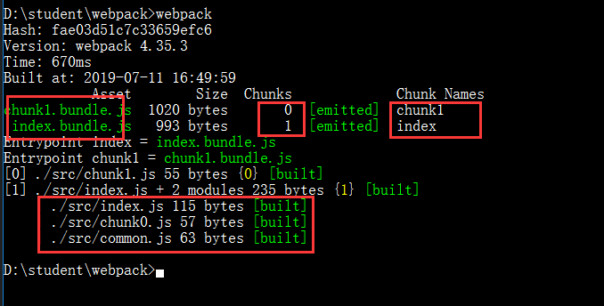

## 简介
bundle、module、chunk都是webpack中的术语，下面就一个一个介绍他们的定义是什么，怎么产生的。
### Bundle
**Bundle**是由多个不同的模块生成，bundles包含了早已经过加载和编译的最终源文件版本。
**Bundle分离（Bundle Splitting）:**这个流程提供了一个优化build的方法，允许webpack为应用程序生成多个bundle。最终效果是，当其他某些 bundle 的改动时，彼此独立的另一些 bundle 都可以不受到影响，减少需要重新发布的代码量，因此由客户端重新下载并利用浏览器缓存。

### Module
**模块（Module）**提供比较完整程序接触面（surface area）更小的离散功能块。精心编写的模块提供了可靠的抽象和封装界限，使得应用程序中每个模块都具有条理清楚的设计和明确的目的。
**模块解析（Module Resolution）**一个模块可以作为另一个模块的依赖模块，resolver是一个库（libary）用于帮助找不到模块的绝对路径，模块将在**resolve.modules**中指定的所有目录内搜索。

### Chunk
**Chunk**这是webpack特定的术语被用在内部来管理building过程。bundle是由chunk组成，其中有几种类型（例如，入口chunk(entry chunk)和子chunk(child chunk)）。通常chunk会直接对应所输出的bundle，但是有一些配置并不会产生一对一的关系。
**代码分离（Code Splitting）**指将代码分离到每个bundles/chunks里面，你可以按需加载，而不是加载一个包含全部的bundle。
**配置（Configuration）**webpack的配置文件是一个普通的JavaScript文件，它导出为一个对象。然后由webpack根据这个对象定义的属性进行处理。

## Bundle VS Chunk VS Module
我们从定义和时期来说：
> - “模块”(module)的概念大家都比较熟悉，如CommonJS模块、AMD、ES6 Modules模块
> - chunk表示打包的时候产生得模块，由他来组成bundle
> - 打包完成的源代码

我们现在就只创建一个能编译js的webpack配置，步骤如下：
> 0. 创建一个空文件加，并且在当文件夹中打开 bash or cmd。
> 1. npm init -y 生成package.json。
> 2. 如果你安装了cnpm or yarn 就执行 cnpm i webpack webpack-cli -D, 安装webpack的包。
> 3. 创建src，在src内部创建chunk0.js、chunk1.js、common.js、index.js，并且编写内部代码
> 4. 在项目根目录创建 webpack.config.js
> 5. 直接在cmd中运行 webpack

下面是代码
**chunk0.js**
```javascript
export default function add (a, b) {
  return a + b;
};
```
**chunk1.js**
```javascript
export default function flow () {
  return 'flow';
};
```
**common.js**
```javascript
export default function commonJs () {
  return 'commonJs';
};
```
**index.js**
```javascript
import add from './chunk0.js';
import commonJs from './common';
console.log(add(1, 2));
console.log(commonJs());
```
**webpack.config.js**
```javascript
module.exports = {
  mode: "production", // 如果不添加就会警告
  entry: {
    index: "./src/index.js", // 一个入口文件
    chunk1: "./src/chunk1.js" // 两一个入口文件
  },
  output: {
    filename: "[name].bundle.js" // 出口文件
  }
}
```
运行的效果如下


通过上面的代码知道，module就是没有被编译之前的代码，通过webpack的根据文件引用关系生成chunk文件，webpack处理好chunk文件后，生成运行在浏览器中的代码bundle。

## 引用
> [https://juejin.im/post/5cede821f265da1bbd4b5630](https://juejin.im/post/5cede821f265da1bbd4b5630)
> [http://qingbob.com/webpack-chunks-split-01/](http://qingbob.com/webpack-chunks-split-01/)
