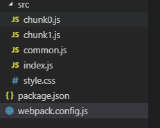
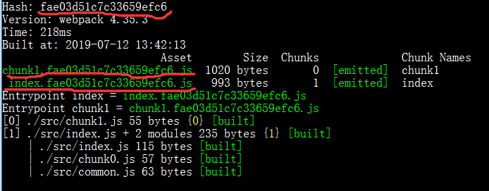
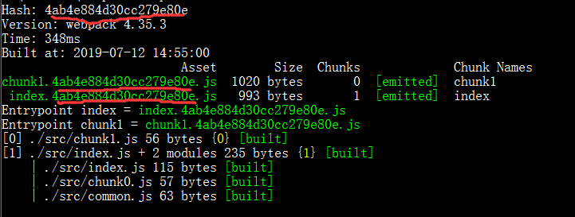
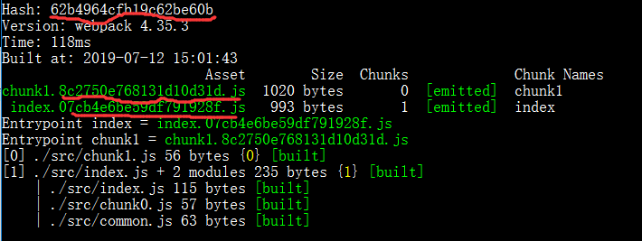
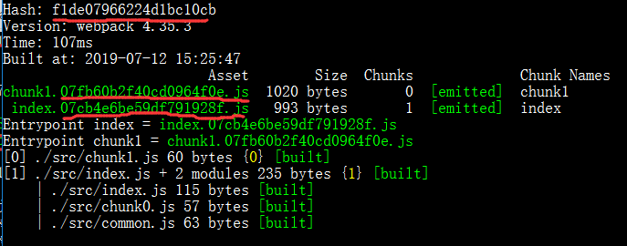
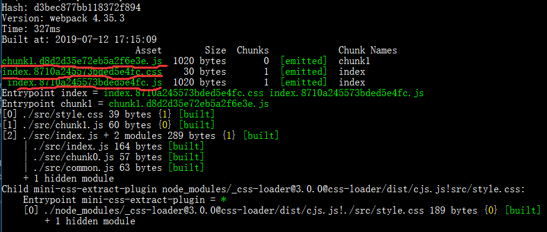
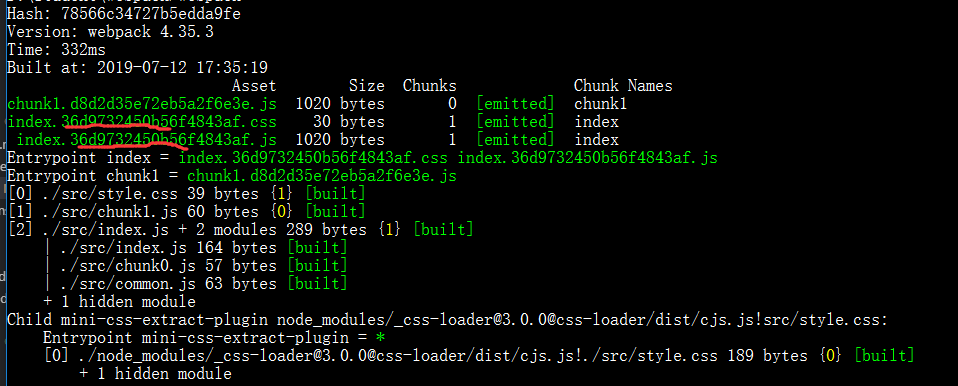
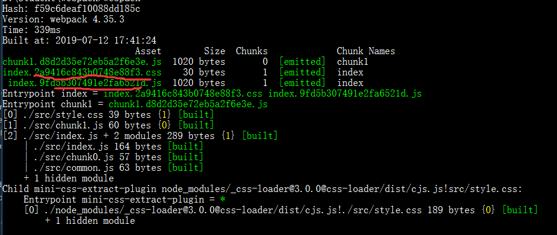
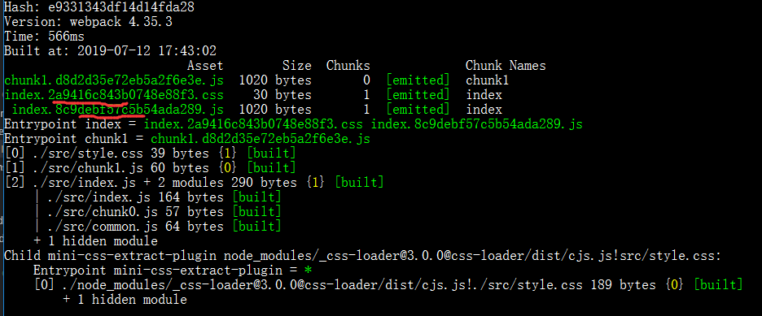

## 简介
在webpack中有三种hash可以配置，分别是hash、chunkhash、contenthash他们是不对的可以针对不同的配置，首相要搞清楚这三种的hash的区别，什么场景下，适合用哪种。
**hash**
所有文件哈希值相同，只要改变内容跟之前的不一致，所有哈希值都改变，没有做到缓存意义
**chunkhash**
当有多个chunk，形成多个bundle时，如果只有一个chunk和一个bundle内容变了，其他的bundle的hash都会发生变化，因为大家都是公用的一个hash，这个时候chunkhash的作用就出来了。它根据不同的入口文件(Entry)进行依赖文件解析、构建对应的 chunk，生成对应的哈希值。
**contenthash**
在打包的时候我们会在js中导入css文件，因为他们是同一个入口文件，如果我只改了js得代码，但是他的css抽取生成css文件时候hash也会跟着变换。这个时候contenthash的作用就出来了。
下面直接用代码验证上面的猜想。
## 一个简单的webpack配置
我们现在就只创建一个能编译js的webpack配置，步骤如下：
> 0. 创建一个空文件加，并且在当文件夹中打开 bash or cmd。
> 1. npm init -y 生成package.json。
> 2. 如果你安装了cnpm or yarn 就执行 cnpm i webpack webpack-cli -D, 安装webpack的包。
> 3. 创建src，在src内部创建chunk0.js、chunk1.js、common.js、index.js、style.css，并且编写内部代码
> 4. 在项目根目录创建 webpack.config.js
> 5. 直接在cmd中运行 webpack

文件目录如下：


下面是代码
**chunk0.js**
```javascript
export default function add (a, b) {
  return a + b;
};
```
**chunk1.js**
```javascript
export default function flow () {
  return 'flow';
};
```
**common.js**
```javascript
export default function commonJs () {
  return 'commonJs';
};
```
**index.js**
```javascript
import add from './chunk0.js';
import commonJs from './common';
console.log(add(1, 2));
console.log(commonJs());
```
**style.css**
```css
body {
  background: #000;
}
```
**webpack.config.js**
```javascript
module.exports = {
  mode: "production", // 如果不添加就会警告
  entry: {
    index: "./src/index.js", // 一个入口文件
    chunk1: "./src/chunk1.js" // 两一个入口文件
  },
  output: {
    filename: "[name].[hash].js" // 出口文件
  }
}
```
## hash
我们直接运行webpack，运行结果如下图所示：
只有一个hash，所有文件的hash都是相同：

如果我们改变修改**chunk1.js**中的代码：
```javascript
export default function flow () {
  return 'flow1'; // flow => folw1
};
```
<font color="blue"></font>
再运行webpack发现所有的hash都<font color="blue">变化</font>了，如下图所示：


对比发现他们的hash并不相同了，这个时候如果想修改了**chunk1.js**,index.js不产生变化，就要用到chunkhash。
## chunkhash
- 第一步 我们先把**webpack.config.js**做一下修改
```javascript
module.exports = {
  mode: "production",
  entry: {
    index: "./src/index.js",
    chunk1: "./src/chunk1.js"
  },
  output: {
    filename: "[name].[chunkhash].js" // hash => chunkhash
  }
}
```
- 第二步 我们运行webpack 

根据上面图片发下，两个chunk的hash并不相同了。
- 第三部 我们修改 chunk1.js
```javascript
export default function flow () {
  return 'flow11111'; // flow1 => flow11111
};
```
- 再运行webpack 


根据图片我们看到了chunk1.js的hash变化，而index.js的hash并没有变化，达到了我们预期的效果，对我们线上的缓存也是比较好的。
## contenthash
但是当我们一个js文件里面引用了一个css文件，如果我么修改了css文件内的内容，我们css中的内容，会发发现这整个bundle的hash也会发生更新。
我们要引入css，并且要把css提出、压缩生成一个css文件，就要借助一个webpack的插件，叫做MiniCssExtractPlugin,他可以帮我提取css到css文件，并且压缩css。
- 第一步先安装css-loader、mini-css-extract-plugin包
```bash
cnpm install css-loader mini-css-extract-plugin -D
```
- 第二步修改webpack.config.js 如下
```javascript
const MiniCssExtractPlugin = require("mini-css-extract-plugin"); // 新增
module.exports = {
  mode: "production",
  entry: {
    index: "./src/index.js",
    chunk1: "./src/chunk1.js"
  },
  output: {
    filename: "[name].[chunkhash].js"
  },
  module: { // 新增
    rules: [
      {
        test: /\.css$/,
        use: [
          MiniCssExtractPlugin.loader, 
          "css-loader"
        ]
      }
    ]
  },
  plugins: [ // 新增
    // 提取css插件
    new MiniCssExtractPlugin({
      // Options similar to the same options in webpackOptions.output
      // both options are optional
      filename: "[name].[chunkhash].css"
    })
  ]
};
```
- 第三步运行webpack

看代码可以看到index.css和index.js的hash是一样的。
- 第四步修改style.css
```javascript
html {
  font-size: 13px;
}
```
- 第五步运行webpack


对比两次构建的hash，发现只修改了style.css的文件，引入他的index.js确也更新了hash，这个时候就需要contenthash来发挥作用了。
- 第六步修改webpack.config.js 并且运行 webpack
```javascript
const MiniCssExtractPlugin = require("mini-css-extract-plugin"); // 新增
module.exports = {
  mode: "production",
  entry: {
    index: "./src/index.js",
    chunk1: "./src/chunk1.js"
  },
  output: {
    filename: "[name].[chunkhash].js"
  },
  module: { // 新增
    rules: [
      {
        test: /\.css$/,
        use: [
          MiniCssExtractPlugin.loader, 
          "css-loader"
        ]
      }
    ]
  },
  plugins: [ // 新增
    // 提取css插件
    new MiniCssExtractPlugin({
      // Options similar to the same options in webpackOptions.output
      // both options are optional
      filename: "[name].[contenthash].css"
    })
  ]
};
```

看到他们直接hash就是不同的。
- 修改common.js，直接运行webpack
```javascript
export default function commonJs () {
  return 'commonJs1';
};
```


看到修改js时我们的css文件的hash并没有变更。

> 注意，当使用contenthash时，如果修改js文件，css文件的hash不会变化，但是修改js的文件，css文件的hash也会变化。

## 总结
hash 所有文件哈希值相同；
chunkhash 根据不同的入口文件(Entry)进行依赖文件解析、构建对应的 chunk，生成对应的哈希值；
contenthash 计算与文件内容本身相关，主要用在css抽取css文件时。
## 引用
> [https://juejin.im/post/5cede821f265da1bbd4b5630](https://juejin.im/post/5cede821f265da1bbd4b5630)