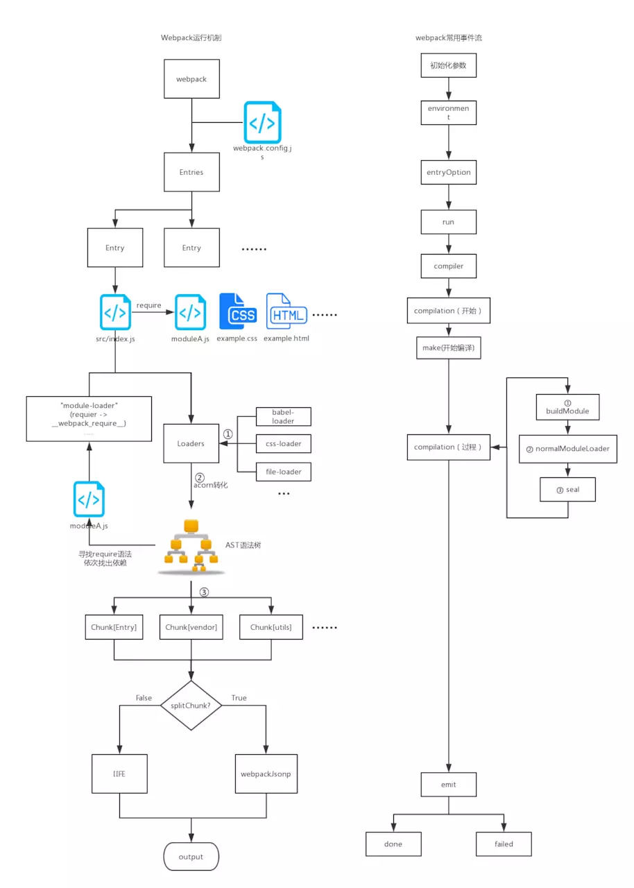
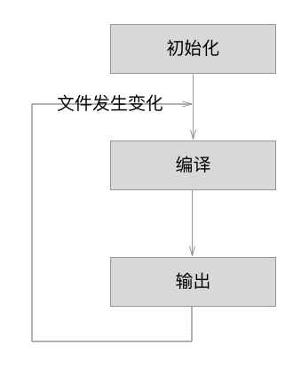
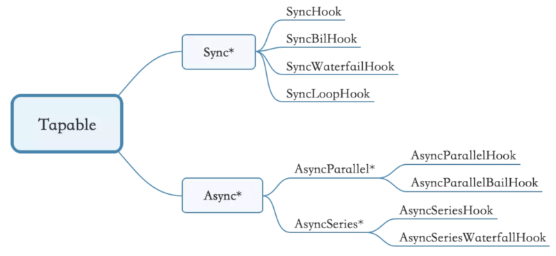

## 简介
现在前端开发基本上都会用到`react`、`vue`，用到了前端`mvc`、`mvvm`框架，基本上都会涉及到打包发布，打包常用的工具就是`webpack`、`gulp`等等。经常使用自然也要了解一些他大致的流程也会方便使用。
首先要理解webpack中比较核心的概念：
- **Entry**: 指定webpack开始构建的入口模块，从该模块开始构建并计算出直接或间接依赖的模块或者库。
- **Output**：告诉webpack如何命名输出的文件以及输出的目录
- **Module**: 模块，在 Webpack 里一切皆模块，一个模块对应着一个文件。Webpack 会从配置的 Entry 开始递归找出所有依赖的模块。
- **Chunk**：`coding split`的产物，我们可以对一些代码打包成一个单独的`chunk`，比如某些公共模块，去重，更好的利用缓存。或者按需加载某些功能模块，优化加载时间。在`webpack3`及以前我们都利用`CommonsChunkPlugin`将一些公共代码分割成一个`chunk`，实现单独加载。在`webpack4` 中`CommonsChunkPlugin`被废弃，使用`SplitChunksPlugin`
- **Loader**：模块转换器，用于把模块原内容按照需求转换成新内容。
- **Plugin**：扩展插件，在 Webpack 构建流程中的特定时机会广播出对应的事件，插件可以监听这些事件的发生，在特定时机做对应的事情。

webpack 执行流程和事件流如下图所示：
 
webpack编译过程中一个比较重要的概念**compiler**、**compilation**，如下：
- **Compiler 对象**：负责文件监听和启动编译。`Compiler` 实例中包含了完整的 `webpack` 配置，全局只有一个 `Compiler` 实例。
- **Compilation 对象**：当 `webpack` 以开发模式运行时，每当检测到文件变化，一次新的 `Compilation` 将被创建。一个 `Compilation` 对象包含了当前的模块资源、编译生成资源、变化的文件等。`Compilation` 对象也提供了很多事件回调供插件做扩展。
<!--  -->

## webpack流程
Webpack的运行流程是一个串行的过程，从启动到结束依次执行以下流程：
1. 初始化：启动构建，读取与合并配置参数，加载 Plugin，实例化 Compiler。
2. 编译：从 Entry 发出，针对每个 Module 串行调用对应的 Loader 去翻译文件内容，再找到该 Module 依赖的 Module，递归地进行编译处理。
3. 输出：对编译后的 Module 组合成 Chunk，把 Chunk 转换成文件，输出到文件系统。
如果只执行一次构建，以上阶段将会按照顺序各执行一次。但在开启监听模式下，流程将变为如下：

下面具体介绍一下 `webpack`的三个大阶段具体的小步。

### 初始化阶段
初始化阶段大致分为：
- 合并shell和配置文件文件的参数并且实例化Complier对象。
- 加载插件
- 处理入口

| 事件名 | 解释 |
|:------:|:------------------------:|
| 初始化参数 | 从配置文件和 Shell 语句中读取与合并参数，得出最终的参数。 这个过程中还会执行配置文件中的插件实例化语句 new Plugin()。  |
| 实例化 Compiler | 用上一步得到的参数初始化 `Compiler` 实例，`Compiler` 负责文件监听和启动编译。`Compiler` 实例中包含了完整的 `Webpack` 配置，全局只有一个 `Compiler` 实例。  |
| 加载插件 | 依次调用插件的 `apply` 方法，让插件可以监听后续的所有事件节点。同时给插件传入 `compiler` 实例的引用，以方便插件通过 `compiler` 调用 `Webpack` 提供的 `API`。  |
| environment | 开始应用 `Node.js` 风格的文件系统到 `compiler` 对象，以方便后续的文件寻找和读取。 |
| entry-option | 读取配置的 `Entrys`，为每个 `Entry` 实例化一个对应的 `EntryPlugin`，为后面该 `Entry` 的递归解析工作做准备。 |
| after-plugins | 调用完所有内置的和配置的插件的 `apply` 方法。 |
| after-resolvers | 根据配置初始化完 `resolver`，`resolver` 负责在文件系统中寻找指定路径的文件。 |

### 编译阶段

| 事件名 | 解释 |
|:------:|:------------------------:|
| before-run  | 清除缓存  |
| run | 启动一次新的编译。  |
| watch-run | 和 `run` 类似，区别在于它是在监听模式下启动的编译，在这个事件中可以获取到是哪些文件发生了变化导致**重新启动**一次新的编译。  |
| compile | 该事件是为了告诉插件一次**新的**编译将要启动，同时会给插件带上 `compiler` 对象。  |
| compilation | 当 `Webpack` 以开发模式运行时，每当检测到文件变化，一次新的 `Compilation` 将被创建。一个 `Compilation` 对象包含了当前的模块资源、编译生成资源、变化的文件等。`Compilation` 对象也提供了很多事件回调供插件做扩展。 |
| make | 一个新的 `Compilation` 创建完毕，即将从 `Entry` 开始读取文件，根据文件类型和配置的 `Loader` 对文件进行编译，编译完后再找出该文件依赖的文件，递归的编译和解析。 |
| after-compile | 一次 `Compilation` 执行完成。这里会根据编译结果 合并出我们最终生成的文件名和文件内容。 |
| invalid | 当遇到文件不存在、文件编译错误等异常时会触发该事件，该事件不会导致 `Webpack` 退出。 |

这里主要最重要的就是`compilation`过程，`compilation` 实际上就是调用相应的 `loader` 处理文件生成 `chunks`并对这些 `chunks` 做优化的过程。几个关键的事件（`Compilation`对象`this.hooks`中）：

| 事件名 | 解释 |
|:------:|:------------------------:|
| build-module | 使用对应的 `Loader` 去转换一个模块。 |
| normal-module-loader | 在用 `Loader` 对一个模块转换完后，使用 `acorn` 解析转换后的内容，输出对应的抽象语法树（`AST`），以方便 `Webpack` 后面对代码的分析。  |
| program | 从配置的入口模块开始，分析其 `AST`，当遇到 `require` 等导入其它模块语句时，便将其加入到**依赖的模块列表**，同时对新找出的**依赖模块递归分析**，最终搞清所有模块的**依赖关系**。  |
| seal | 所有模块及其**依赖**的模块都通过 `Loader` 转换完成后，根据依赖关系开始生成 `Chunk`。 |

### 输出阶段

| 事件名 | 解释 |
|:------:|:------------------------:|
| should-emit |	所有需要输出的文件已经生成好，询问插件哪些文件需要输出，哪些不需要。|
| emit	| 确定好要输出哪些文件后，执行文件输出，可以在这里获取和修改输出内容。 |
| after-emit	| 文件输出完毕。|
| done	| 成功完成一次完成的编译和输出流程。|
| failed	| 如果在编译和输出流程中遇到异常导致 `Webpack` 退出时，就会直接跳转到本步骤，插件可以在本事件中获取到具体的错误原因。|


## Tapable
`Webpack`可以将其理解是一种基于**事件流**的编程范例，一个插件**合集**。而将这些插件控制在`webapck`事件流上的运行的就是`webpack`自己写的基础类`Tapable`。`Webpack` 的**事件流**机制应用了**观察者模式**，和 `Node.js` 中的 `EventEmitter`非常相似。
**Tapable 有四组成员函数**：
- **plugin(name:string, handler:function)**：允许将一个自定义插件注册到 `Tapable` 实例 的事件中。它的行为和 `EventEmitter` 的 `on()` 方法相似，用来注册一个**处理函数/监听器**，来在**信号/事件**发生时做一些事情。
- **apply(…pluginInstances**: `(AnyPlugin|function)[])：AnyPlugin` 应该是一个拥有 `apply` 方法的类（也可以是一个对象，但是不常见），或者只是一个包含注册代码的函数。这个方法只调用插件的定义，从而将真正的事件监听器可以注册到 `Tapable` 实例的注册列表中。
- **applyPlugins*(name:string, …)**：`Tapable` 实例可以通过使用这些函数，在指定的 `hash` 下应用所有的插件。这一组方法的行为和 `EventEmitter` 的 `emit()` 方法相似，使用多种策略细致地控制事件的触发。
- **mixin(pt: Object)**：一个简单地方法，使用混入而不是继承的方式扩展 `Tapable` 的原型。

上面核心的对象 `Compiler`、`Compilation`等都是继承于`Tabable`类。可以直接在 `Compiler` 和 `Compilation` 对象上广播和监听器，方法如下：
```javascript
  /**
  * 广播出事件
  * event-name 为事件名称，注意不要和现有的事件重名
  * params 为附带的参数
  */
  compiler.apply('event-name',params);

  /**
  * 监听名称为 event-name 的事件，当 event-name 事件发生时，函数就会被执行。
  * 同时函数中的 params 参数为广播事件时附带的参数。
  */
  compiler.plugin('event-name',function(params) {
    doSomeThing();
  });
```
同理，compilation.apply 和 compilation.plugin 使用方法和上面一致。


[tapable](https://github.com/webpack/tapable)库暴露了很多Hook（钩子）类，为插件提供挂载的钩子。
```javascript
  const {
    SyncHook,
    SyncBailHook,
    SyncWaterfallHook,
    SyncLoopHook,
    AsyncParallelHook,
    AsyncParallelBailHook,
    AsyncSeriesHook,
    AsyncSeriesBailHook,
    AsyncSeriesWaterfallHook
 } = require("tapable");
```
如下图所示tapable上的钩子：


tabable的提供了两类绑定钩子的方式：
- **AsyncHook(异步钩子)**： **绑定**可以通过`tapAsync` 或 `tapPromise`（以及 `tap`），**执行**通过 `callAsync`、`promise`；
- **syncHook(钩子)**： **绑定**可以通过`tap`，**执行**通过 `call`；

具体的用法请看[Tapable](https://github.com/webpack/tapable#tapable)。

## 总结
Webpack 的运行流程是一个串行的过程，从启动到结束会依次执行以下流程：
1. **初始化参数：从配置文件和 Shell 语句中读取与合并参数，得出最终的参数**；
2. **开始编译：用上一步得到的参数初始化 Compiler 对象，加载所有配置的插件，执行对象的 run 方法开始执行编译**；
3. **确定入口：根据配置中的 entry 找出所有的入口文件**；
4. **编译模块：从入口文件出发，调用所有配置的 Loader 对模块进行翻译，再找出该模块依赖的模块，再递归本步骤直到所有入口依赖的文件都经过了本步骤的处理**；
5. **完成模块编译：在经过第4步使用 Loader 翻译完所有模块后，得到了每个模块被翻译后的最终内容以及它们之间的依赖关系**；
6. **输出资源：根据入口和模块之间的依赖关系，组装成一个个包含多个模块的 Chunk，再把每个 Chunk 转换成一个单独的文件加入到输出列表，这步是可以修改输出内容的最后机会**；
7. **输出完成：在确定好输出内容后，根据配置确定输出的路径和文件名，把文件内容写入到文件系统**。

同时我们也了解了webpack中比较核心的几个概念`compiler`、`compilation`、`tapable`。

## 参考
> [webpack学习笔记（原理，实现loader和插件）](https://mp.weixin.qq.com/s?__biz=MzI5MjUxNjA4Mw==&mid=2247484465&idx=1&sn=13e809bbad1aded06089f9f90f54280f&chksm=ec017daddb76f4bb998db48b7b60ef61ce69f18a389b5d371f5abdec6af6e1e3819eaceb2194&mpshare=1&scene=1&srcid=0724xrEwBfryLPOe61Ki51Oi&sharer_sharetime=1563935222192&sharer_shareid=491f5e3b572f21d39b90888df1c8829b&key=4a20f31792598319b088ea3b82b6daf06773b3d7ffa59c0bb5d9ec0f7388ff5fed13910f4aacc420e4591fbc921b91b777b3904d18b7e88b4a3fee042e9d5df41b3746bc994433035daadda223075e98&ascene=1&uin=MTY4MzM5MzY2Mw%3D%3D&devicetype=Windows+10&version=62060833&lang=zh_CN&pass_ticket=4jkq%2FusyjX7RQyhKNRuqJ4ao5EVltuqP5Geyej5jy%2BYFRnQMWIS09yOSU9wir8dM)
> [webpack 源码分析六：webpack 处理流程分析](https://github.com/lihongxun945/diving-into-webpack/blob/master/6-process-pipe-line.md)
> [Webpack原理与实践（一）：打包流程](https://juejin.im/post/5be9297351882516f5786404)