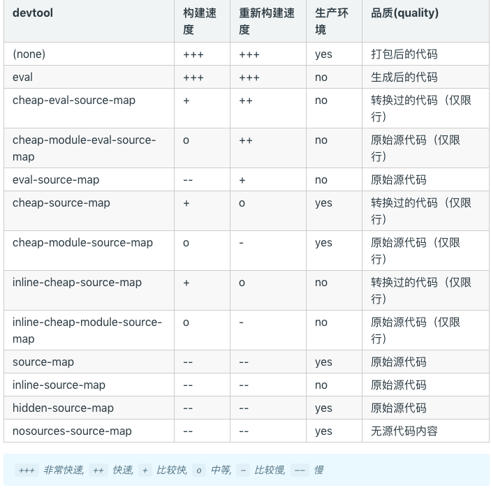
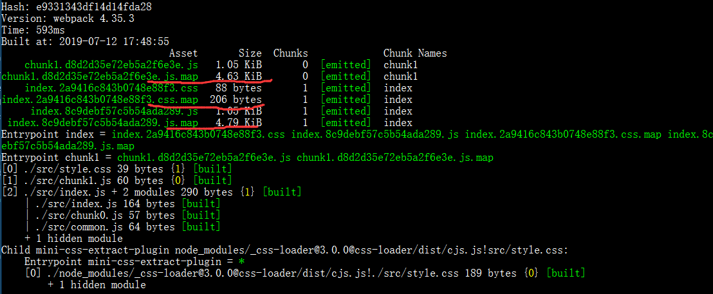

## 简介
在webpack中的比如在调试vue代码或者react代码中，调试打包后的代码时候，我们都会用到一个叫做soruce-map，我们都是通过devtool来配置。比如说在vue-cli或者create-react-app中都有用到，source-map有很多种，我们在这里记录一下他们对应的解释。
在编写vue、react的时候，我们想做懒加载是，有非常适合chunk splitting的模块，比如说vue-router、react-router，在做懒加载切割的时候有三个要注意的不如说WebpackChunkName、WebpackPreload、WebpackPrefetch三个配置，他们分别对应chunk的name，和chunk代码何时被加载。
> [chunkhas-hash-contenthash](/blog/webpack/webpack-chunkhas-hash-contenthash.html)
## source-map
当 webpack 打包源代码时，可能会很难追踪到 error(错误) 和 warning(警告) 在源代码中的原始位置。source-map就是帮忙**追踪rror(错误) 和 warning(警告)的**。
通过下面官方提供的表格一览devtool对应source-map的配置和速度影响：

在这个上面那种适合prod那种适合dev环境，还有构建速度和重新构建速度等等。我们可以在上面的基础上再把所有的配置分为四类，**cheap、inline、eval、module**四种，再在这种基础上看一下他们的区别，当然官方提供了devtool各种配置下得具体区别，有兴趣的可以看一下[devtool各种打包区别](https://github.com/webpack/webpack/tree/master/examples/source-map)。

**heap、inline、eval、module四种解释如下图标所示**

| 带有参数	| 不同的表现 |
|:----------:|:-------------:|
| cheap |  带有cheap参数的表示，在追踪error、warning时，只显示当前文件的行数，不显示当前在行数中的列数 |
| inline |  source map 转换为 DataUrl（base64） 后添加到 bundle 中，不产生source-map文件 |
| eval |  打包后的模块都使用 eval() 执行，行映射可能不准；不产生独立的 map 文件， 四中带有eval的对比请看[四中eval对比](https://webpack.docschina.org/configuration/devtool#%E5%AF%B9%E4%BA%8E%E5%BC%80%E5%8F%91%E7%8E%AF%E5%A2%83) |
| module | 增加第三方库的error、warning追踪 |

在下面对比source-map、eval-source-map、cheap-source-map、cheap-module-source-map、inline-souce-map来验证我们上面的总结
基础代码是在[另一篇博客](/blog/webpack/webpack-chunkhas-hash-contenthash.html)中
### source-map
webpack中用使用devtool，修改webpack.config.js文件代码如下：
```javascript
const MiniCssExtractPlugin = require("mini-css-extract-plugin"); // 新增
module.exports = {
  mode: "production",
  devtool: 'source-map',
  entry: {
    index: "./src/index.js",
    chunk1: "./src/chunk1.js"
  },
  output: {
    filename: "[name].[chunkhash].js"
  },
  module: { // 新增
    rules: [
      {
        test: /\.css$/,
        use: [
          MiniCssExtractPlugin.loader, 
          "css-loader"
        ]
      }
    ]
  },
  plugins: [ // 新增
    // 提取css插件
    new MiniCssExtractPlugin({
      // Options similar to the same options in webpackOptions.output
      // both options are optional
      filename: "[name].[contenthash].css"
    })
  ]
};
```
运行webpack结果如下：

可以看到多了三个文件，就是对应我们业务代码bundle的map映射。
### eval-source-map
修改devtool，修改webpack.config.js文件代码如下：
```javascript
```
### cheap-source-map

### cheap-module-source-map

### inline-souce-map

## 总结
**devtool**
- 在dev环境中推荐使用 cheap-module-eval-source-map
- 在生产环境不推荐使用devtool一般都是使用false、‘none’，如果线上有错误日志收集的话推荐使用 source-map。

> 注意：如果生产环境上使用了source-map，你应该将你的服务器配置为，不允许普通用户访问 source map 文件！
